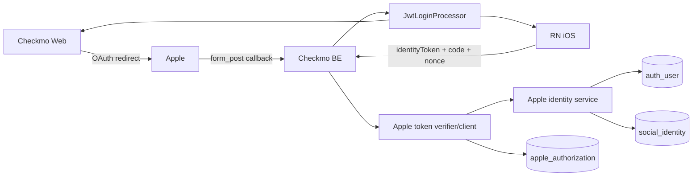

# Apple 로그인 백엔드 구현 계획

> 작성 기준일: 2026-06-21 KST
> 기준 코드: `ref_code/BE` `develop`
> 연동 대상: 웹(`kr.co.checkmo.web`) + RN iOS(`kr.co.checkmo.app`)
> 상태: 구현 대기

## 1. 목표와 결정 사항

Checkmo의 기존 이메일 로그인, Google/Kakao/Naver 웹 OAuth, JWT 쿠키 및 앱 refresh token 구조를 유지하면서 Apple 로그인을 추가한다.

- 웹은 기존 Spring Security redirect 방식을 따른다.
- RN iOS는 Apple 네이티브 credential을 앱 전용 API로 교환한다.
- `AuthUser.email`에는 실제 Apple 이메일 또는 relay 이메일을 그대로 저장한다.
- Apple 회원 식별은 이메일이 아니라 Apple `sub`를 사용한다.
- 최초 `sub` 매핑이 없고 검증 이메일이 기존 회원과 같으면 해당 회원에 자동 연결한다.
- 신규 회원은 `profileCompleted=false`로 생성하고 기존 `CreateMember` 이벤트를 재사용한다.
- 신규 소셜 회원은 약관 저장 후 프로필을 완성한다. 약관 데이터 계약은 기존 약관 계획을 선행 조건으로 사용한다.
- Android 네이티브 Apple 로그인은 이번 범위에 포함하지 않는다.
- 기존 Google/Kakao/Naver identity를 새 테이블로 역마이그레이션하지 않는다.

## 2. Apple Developer 설정

확정된 운영 설정은 다음과 같다.

| 항목 | 값 |
| --- | --- |
| Team ID | `737FQ6NT2H` |
| Key ID | `3QC69R4247` |
| Primary App ID / iOS client ID | `kr.co.checkmo.app` |
| Web Services ID | `kr.co.checkmo.web` |
| Domains | `checkmo.co.kr`, `api.checkmo.co.kr` |
| Web Return URL | `https://api.checkmo.co.kr/login/oauth2/code/apple` |

화면의 Team ID와 Key ID는 식별자이며 서버 설정에 사용할 수 있다. 다운로드한 `.p8` 파일 본문은 Git, 문서, Docker image, 로그, Sentry context에 넣지 않는다. 비밀 관리 서비스 또는 배포 환경 secret으로만 주입한다.

## 3. 현재 인증 구조 조사 결과

### 웹 OAuth

- `application-oauth2.yml`에 Google/Kakao/Naver registration이 있다.
- 시작 경로는 `/oauth2/authorization/{registrationId}`다.
- callback은 `https://api.checkmo.co.kr/login/oauth2/code/{registrationId}`다.
- `CustomOAuth2UserService`가 provider attributes에서 email/provider ID를 추출한다.
- 현재는 `AuthRepository.findByEmail()`로 기존 회원을 찾고, 신규면 `<PROVIDER>_<providerId>` ID를 만든다.
- `OAuth2AuthenticationSuccessHandler`가 `JwtLoginProcessor`로 쿠키를 발급하고 웹으로 redirect한다.
- `OAuth2AuthenticationFailureHandler`의 상대 `/login?error=true`는 API 도메인으로 이동하므로 웹 오류 UX에 맞지 않는다.

### 앱 세션

- `POST /api/v1/auth/app/login`은 Checkmo refresh token을 응답 body에 반환한다.
- RN은 refresh token을 SecureStore에 보관하고 `/api/v1/auth/app/refresh`로 회전한다.
- Apple 앱 로그인도 같은 Checkmo token 발급·회전 계약을 사용해야 한다.

### 프로필·약관 상태

- `ProfileCompletionAuthorizationFilter`는 `profileCompleted=false` 회원의 일반 API를 403으로 차단한다.
- `AuthErrorStatus.MEMBER_PROFILE_NOT_COMPLETED`는 `AUTH_403`이다.
- 신규 소셜 회원의 약관 체크는 현재 클라이언트 메모리에만 있고 DB에 저장되지 않는다.
- 약관 저장과 재동의 게이트는 아래 문서가 소유한다.
  - [약관 동의 매핑 백엔드 계획](./(done)terms-agreement-backend-plan.md)
  - [약관 동의 매핑 웹 계획](./(done)terms-agreement-fe-plan.md)
  - [약관 동의 매핑 RN 계획](./(done)terms-agreement-rn-plan.md)

## 4. 목표 아키텍처



웹과 앱은 credential 수집 방식만 다르다. 검증이 끝난 뒤에는 하나의 `AppleIdentityService`가 회원 조회·자동 연결·신규 생성 규칙을 처리한다.

## 5. 데이터 모델

### `social_identity`

Apple `sub`와 Checkmo 회원을 연결한다.

```sql
CREATE TABLE social_identity (
    id BIGINT NOT NULL AUTO_INCREMENT,
    auth_user_id VARCHAR(255) NOT NULL,
    provider VARCHAR(20) NOT NULL,
    provider_subject VARCHAR(255) NOT NULL,
    provider_email VARCHAR(255) NULL,
    created_at DATETIME(6) NOT NULL,
    updated_at DATETIME(6) NOT NULL,
    PRIMARY KEY (id),
    CONSTRAINT fk_social_identity_auth_user
        FOREIGN KEY (auth_user_id) REFERENCES auth_user(id),
    CONSTRAINT uk_social_identity_provider_subject
        UNIQUE (provider, provider_subject),
    CONSTRAINT uk_social_identity_user_provider
        UNIQUE (auth_user_id, provider)
);
```

- provider 값은 우선 `APPLE`만 사용한다.
- Apple `sub` 원문은 `AuthUser.id`에 넣지 않는다.
- 한 Apple identity는 한 Checkmo 회원에만 연결한다.
- 한 Checkmo 회원에는 Apple identity를 하나만 연결한다.
- `provider_email`은 최초 검증 이메일 감사·운영 확인용이며 로그인 키가 아니다.

### `apple_authorization`

Apple refresh token은 client ID별로 발급되므로 identity와 분리한다.

```sql
CREATE TABLE apple_authorization (
    id BIGINT NOT NULL AUTO_INCREMENT,
    social_identity_id BIGINT NOT NULL,
    client_id VARCHAR(255) NOT NULL,
    refresh_token_ciphertext TEXT NULL,
    encryption_key_version VARCHAR(32) NULL,
    revoke_status VARCHAR(20) NOT NULL DEFAULT 'ACTIVE',
    revoke_retry_count INT NOT NULL DEFAULT 0,
    revoke_next_retry_at DATETIME(6) NULL,
    created_at DATETIME(6) NOT NULL,
    updated_at DATETIME(6) NOT NULL,
    PRIMARY KEY (id),
    CONSTRAINT fk_apple_authorization_identity
        FOREIGN KEY (social_identity_id) REFERENCES social_identity(id),
    CONSTRAINT uk_apple_authorization_identity_client
        UNIQUE (social_identity_id, client_id)
);
```

- `client_id`는 `kr.co.checkmo.app` 또는 `kr.co.checkmo.web`이다.
- refresh token은 AES-GCM 인증 암호화 후 저장한다.
- 암호문에 사용한 key version을 별도 기록해 rotation을 지원한다.
- 새 authorization code 교환에서 refresh token이 반환되면 해당 client row를 갱신한다.
- token, IV, tag, 평문 길이를 로그로 출력하지 않는다.

정확한 timestamp default, index 명명, FK 삭제 정책은 현재 Flyway/엔티티 관례를 따른다. migration은 추가형으로 만들고 기존 `auth_user` 데이터는 수정하지 않는다.

## 6. 공통 회원 조회 규칙

모든 생성·연결은 하나의 트랜잭션에서 수행한다.

### 1순위: `APPLE + sub`

1. `social_identity(provider=APPLE, providerSubject=sub)`를 조회한다.
2. 존재하면 연결된 `AuthUser`를 반환한다.
3. 재로그인 token에 email이 없더라도 성공시킨다.
4. token email이 바뀌어도 다른 회원으로 재연결하지 않는다.

### 2순위: 검증 이메일 자동 연결

identity가 없고 Apple이 검증한 email이 존재하면 `AuthRepository.findByEmail()`을 실행한다.

- 기존 회원이 있으면 Apple identity를 생성하고 해당 회원을 반환한다.
- 기존 회원의 ID, password, profile, 작성 데이터는 변경하지 않는다.
- 대소문자 정규화는 현재 회원가입 중복 정책과 동일하게 적용한다.
- 동일 회원에 다른 Apple identity가 있거나 동일 `sub`가 다른 회원에 연결돼 있으면 `APPLE_AUTH_409`다.
- 실제 Gmail과 Apple relay email은 다른 문자열이므로 relay를 선택한 사용자는 보통 신규 회원이 된다.

### 3순위: 신규 회원

1. email이 있고 `email_verified=true`인지 확인한다.
2. `APPLE_<8자리 UUID>` 내부 ID를 생성한다.
3. password `""`, role `USER`, `profileCompleted=false`로 `AuthUser`를 저장한다.
4. `AuthenticationEvent.CreateMember(id, email)`를 발행한다.
5. 동일 트랜잭션에서 `social_identity`를 저장한다.
6. `isNewUser=true`를 반환한다.

최초 로그인에 검증 email이 없으면 현재 `AuthUser.email`/`Member.email` NOT NULL 모델을 만족할 수 없으므로 실패시킨다. 이미 `sub`가 연결된 회원은 email claim 없이 재로그인할 수 있다.

### 경쟁 조건

- 애플리케이션 사전 조회가 아니라 DB unique constraint를 최종 기준으로 사용한다.
- insert 충돌 시 동일 `sub`를 다시 조회한다.
- 같은 회원으로 수렴하면 로그인 계속, 다른 회원이면 `APPLE_AUTH_409`를 반환한다.
- `AuthUser`만 남고 `Member`/identity가 없는 부분 저장을 허용하지 않는다.

## 7. Apple 검증 공통 컴포넌트

### 설정값

```dotenv
APPLE_TEAM_ID=737FQ6NT2H
APPLE_KEY_ID=3QC69R4247
APPLE_IOS_CLIENT_ID=kr.co.checkmo.app
APPLE_WEB_CLIENT_ID=kr.co.checkmo.web
APPLE_PRIVATE_KEY=<secret manager의 p8 본문 또는 mounted secret 경로>
APPLE_TOKEN_ENCRYPTION_KEY=<base64 AES key>
APPLE_TOKEN_ENCRYPTION_KEY_VERSION=v1
```

`.env.example`에는 이름과 placeholder만 추가한다.

### client secret

- `.p8` EC private key로 ES256 JWT를 생성한다.
- header: `kid=3QC69R4247`, `alg=ES256`
- claims: `iss=737FQ6NT2H`, `aud=https://appleid.apple.com`, `sub=<요청 client ID>`, `iat`, `exp`
- iOS code 교환에는 `sub=kr.co.checkmo.app`을 사용한다.
- Web code 교환에는 `sub=kr.co.checkmo.web`을 사용한다.
- 만료 secret을 정적 환경변수로 장기간 보관하지 않고 요청 시 생성하거나 짧게 캐시한다.

### ID Token

1. header `alg=RS256`, `kid` 확인
2. Apple JWKS에서 공개키 조회 및 서명 검증
3. `iss=https://appleid.apple.com`
4. 호출 채널에 맞는 `aud` 검증
5. `exp`, `iat`와 허용 clock skew 검증
6. `sub` 필수 검증
7. 신규/자동 연결 시 `email`과 `email_verified=true` 검증
8. RN은 추가로 `nonce=SHA-256(rawNonce)` 검증

JWKS는 응답 cache header를 존중해 메모리 캐시한다. 알 수 없는 `kid`는 한 번 강제 갱신 후에도 없으면 인증 실패로 처리한다.

## 8. 웹 OAuth/OIDC 흐름

### registration/provider

`application-oauth2.yml`에 `apple`을 추가한다.

```yaml
spring:
  security:
    oauth2:
      client:
        registration:
          apple:
            client-id: ${APPLE_WEB_CLIENT_ID}
            client-authentication-method: client_secret_post
            authorization-grant-type: authorization_code
            redirect-uri: "https://api.checkmo.co.kr/login/oauth2/code/apple"
            scope: [openid, name, email]
        provider:
          apple:
            authorization-uri: https://appleid.apple.com/auth/authorize
            token-uri: https://appleid.apple.com/auth/token
            jwk-set-uri: https://appleid.apple.com/auth/keys
            user-name-attribute: sub
```

실제 token 요청의 client secret은 동적 생성기로 주입한다. 설정 파일에 만료 JWT를 고정하지 않는다.

### authorization request와 callback

- 시작: `GET /oauth2/authorization/apple`
- callback: `POST /login/oauth2/code/apple`
- scope가 있으므로 authorization request에 `response_mode=form_post`를 명시한다.
- Apple은 cross-site POST로 callback하므로 `JSESSIONID SameSite=Lax`에 의존하지 않는다.
- 기존 Redis에 `state → serialized authorization request`를 TTL 5분으로 저장한다.
- callback에서 state를 상수 시간 검증하고 읽은 즉시 삭제한다.
- state 없음·만료·재사용은 인증 실패다.

### OIDC user service

Apple은 일반 user-info endpoint가 없으므로 기존 `CustomOAuth2UserService extends DefaultOAuth2UserService`에 억지로 포함하지 않는다.

- Google/Kakao/Naver: 기존 `.userService(customOAuth2UserService)` 유지
- Apple: 별도 `.oidcUserService(appleOidcUserService)` 사용
- `OidcIdToken` claim에서 `sub`, email, `email_verified` 추출
- 공통 `AppleIdentityService`로 회원 resolve
- `PrincipalDetails`와 success handler가 사용할 신규 가입 여부를 보존하는 Apple OIDC principal 제공
- token exchange 결과의 refresh token은 `apple_authorization(clientId=kr.co.checkmo.web)`에 암호화 저장

### 성공·실패 redirect

| 상태 | redirect |
| --- | --- |
| 프로필 완료 | `${FRONTEND_BASE_URI}/` |
| 신규 Apple 회원 | `${FRONTEND_BASE_URI}/signup/terms?isSocial=true` |
| 기존 프로필 미완성 | `${FRONTEND_BASE_URI}/signup/profile?isSocial=true&profileRequired=true` |
| 실패 | `${FRONTEND_BASE_URI}/?authError=<public-code>` |

오류 query에는 provider token, email, 예외 message를 넣지 않는다. 성공 시 기존 `JwtLoginProcessor`로 Checkmo 쿠키와 Redis refresh token을 발급한다.

## 9. RN 앱 API

### 계약

```http
POST /api/v1/auth/app/apple/login
Content-Type: application/json
```

```json
{
  "identityToken": "eyJ...",
  "authorizationCode": "c...",
  "rawNonce": "32-byte-random-value"
}
```

```json
{
  "isSuccess": true,
  "code": "COMMON_200",
  "message": "성공입니다.",
  "result": {
    "refreshToken": "checkmo-refresh-token",
    "isProfileCompleted": false,
    "isNewUser": true
  }
}
```

세 요청 필드는 모두 `@NotBlank`다. 응답 boolean 이름은 JSON에서 명시적으로 고정한다.

### 처리 순서

1. ID Token signature/issuer/audience/expiry/nonce 검증
2. `POST https://appleid.apple.com/auth/token`에서 authorization code 교환
3. 교환 응답 ID Token의 `sub`와 최초 token `sub` 비교
4. authorization code 재사용 거부
5. 공통 회원 resolve
6. Apple refresh token을 iOS client row에 암호화 저장
7. `PrincipalDetails` 생성 후 `JwtLoginProcessor`로 Checkmo token 발급
8. Checkmo refresh token만 응답 body에 반환

## 10. 오류 계약

| HTTP | 코드 | 조건 |
| --- | --- | --- |
| 400 | `APPLE_AUTH_400` | credential 형식 오류, 최초 가입의 검증 email 없음 |
| 401 | `APPLE_AUTH_401` | token/code/state/nonce/issuer/audience/만료 검증 실패 |
| 409 | `APPLE_AUTH_409` | identity가 다른 회원에 연결됨 또는 동시 연결 충돌 |
| 502 | `APPLE_AUTH_502` | Apple JWKS/token/revoke endpoint 장애·timeout |
| 500 | `AUTH_500` | DB, 암호화, Checkmo JWT 발급 내부 오류 |

내부 원인은 서버 로그 correlation ID로만 추적하고 credential 원문은 남기지 않는다.

## 11. 약관·프로필 게이트

Apple 인증 직후 계정과 세션은 존재하지만 신규 회원은 일반 기능을 사용할 수 없다.

```text
Apple 인증
→ 신규/기존 회원 resolve
→ 현재 필수 약관 상태 조회
→ 미동의: 약관 저장 API만 허용
→ 동의 완료: additional-info 허용
→ 프로필 완료: 일반 API 허용
```

- 약관 미동의가 프로필 미완성보다 우선한다.
- `GET/POST /api/v1/members/me/terms`, logout, OAuth callback, 앱 Apple 로그인은 onboarding allowlist에 포함한다.
- `additional-info`는 현재 필수 약관 동의까지 확인한 뒤 프로필 완료 처리한다.
- 구체적 schema/API/단계적 enforcement는 [약관 백엔드 계획](./(done)terms-agreement-backend-plan.md)을 따른다.

## 12. 로그아웃·탈퇴·해지

일반 로그아웃은 Apple authorization을 revoke하지 않고 Checkmo 세션만 종료한다.

회원탈퇴 시:

1. 회원의 Apple identity와 ACTIVE client authorizations 조회
2. 각 row의 refresh token 복호화
3. 해당 row의 client ID로 Apple client secret 생성
4. `POST https://appleid.apple.com/auth/revoke`
5. 성공 시 ciphertext 제거 및 `REVOKED`
6. timeout/5xx는 `REVOKE_PENDING`, 다음 재시각 기록
7. Apple 장애와 무관하게 Checkmo soft delete와 세션 폐기 완료

스케줄러는 지수 backoff로 pending을 재시도한다. hard delete 전에 pending 상태를 확인하며 영구 실패는 민감값 없이 운영 알림으로 보낸다.

## 13. 변경 단위

| 영역 | 책임 |
| --- | --- |
| Flyway/entity/repository | 두 신규 테이블과 unique constraint |
| Apple properties/crypto | Team/Key/client 설정, client secret, refresh token 암호화 |
| Apple HTTP/JWT client | JWKS, token, revoke 호출과 timeout |
| Apple identity service | sub 우선 조회, 이메일 자동 연결, 신규 회원 생성 |
| OAuth2 config | Apple registration, form_post, Redis state, OIDC user service |
| Auth controller/DTO/facade | 앱 Apple 로그인 API와 Checkmo token 발급 |
| success/failure handler | 신규·미완성·완료 redirect와 공개 오류 처리 |
| withdrawal scheduler | client별 revoke와 재시도 |
| error/OpenAPI | `APPLE_AUTH_*`와 요청·응답 문서화 |

`MemberQueryFacade.retrieveLoginStatus()`는 신규 `APPLE_*` 회원이면 provider `APPLE`을 반환한다. 기존 LOCAL/KAKAO/GOOGLE/NAVER 회원에 Apple이 연결된 경우 기존 provider 표시는 유지한다. 복수 provider 목록 API는 이번 범위가 아니다.

## 14. 테스트

### 단위 테스트

- ES256 client secret claim과 client별 `sub`
- refresh token AES-GCM round trip, 변조/잘못된 key version 실패
- Apple JWKS cache와 unknown kid refresh
- 모든 ID Token claim 및 RN nonce 검증
- 회원 resolve 세 분기와 email 없는 재로그인
- unique 충돌 재조회와 다른 회원 충돌

### API·보안 통합 테스트

- 웹 authorization redirect에 `response_mode=form_post`, state, nonce 포함
- Redis state 만료·재사용·불일치 거부
- Apple callback 신규/기존/relay 사용자
- RN 정상 로그인과 누락 credential/code 재사용
- web/iOS authorization row가 각각 생성됨
- 신규 회원의 약관 → 프로필 게이트 순서
- 기존 Google/Kakao/Naver 및 이메일 로그인 회귀
- 탈퇴 시 두 client revoke, 일부 실패 pending, 재시도 성공
- 응답·로그에 token/code/nonce/private key 없음

Apple 외부 통신은 mock server/interface mock을 사용하고 CI가 운영 secret이나 실제 Apple 계정에 의존하지 않게 한다.

## 15. 배포·관측·롤백

1. 약관 API를 호환 모드로 선배포한다.
2. Flyway와 Apple 공통 컴포넌트를 배포한다.
3. 운영 secret을 주입하고 callback/JWKS/token 통신 smoke test를 수행한다.
4. 웹 Apple 로그인을 배포한다.
5. RN EAS development/TestFlight 검증 후 iOS 앱을 배포한다.
6. 약관 enforcement를 계획된 단계로 활성화한다.

관측 항목:

- 채널별 성공률과 `APPLE_AUTH_*` 비율
- Apple endpoint latency/timeout
- 신규 가입·이메일 자동 연결·409 수
- Redis state 만료/재사용 수
- client별 authorization 보유 수와 revoke pending 최장 시간

문제 발생 시 웹/RN 버튼을 먼저 숨긴다. API와 revoke 처리는 기존 Apple 회원을 위해 유지하고, 신규 테이블을 즉시 drop하거나 자동 연결 데이터를 임의 삭제하지 않는다.

## 16. 완료 조건

- [ ] 웹과 RN API가 같은 `APPLE + sub` 회원으로 수렴한다.
- [ ] 실제/relay 이메일이 `AuthUser.email`에 정상 저장된다.
- [ ] 웹 form_post/state/OIDC와 RN token/code/nonce가 모두 검증된다.
- [ ] client별 Apple refresh token이 암호화 저장·해지된다.
- [ ] 신규 회원이 약관 저장 전 프로필·일반 API에 접근하지 못한다.
- [ ] 기존 OAuth·이메일·Checkmo refresh 흐름이 회귀하지 않는다.
- [ ] OpenAPI, 자동 테스트, 운영 secret/관측 설정이 준비된다.

## 17. 공식 자료

- [Apple - Sign in with Apple](https://developer.apple.com/documentation/signinwithapple)
- [Apple - Verifying a user](https://developer.apple.com/documentation/signinwithapple/verifying-a-user)
- [Apple - Token validation](https://developer.apple.com/documentation/signinwithapplerestapi/generate-and-validate-tokens)
- [Apple - Configure Sign in with Apple for the web](https://developer.apple.com/help/account/capabilities/configure-sign-in-with-apple-for-the-web/)
- [Apple TN3194 - Account deletion and token revocation](https://developer.apple.com/documentation/technotes/tn3194-handling-account-deletions-and-revoking-tokens-for-sign-in-with-apple)
- [Apple JWKS](https://appleid.apple.com/auth/keys)
