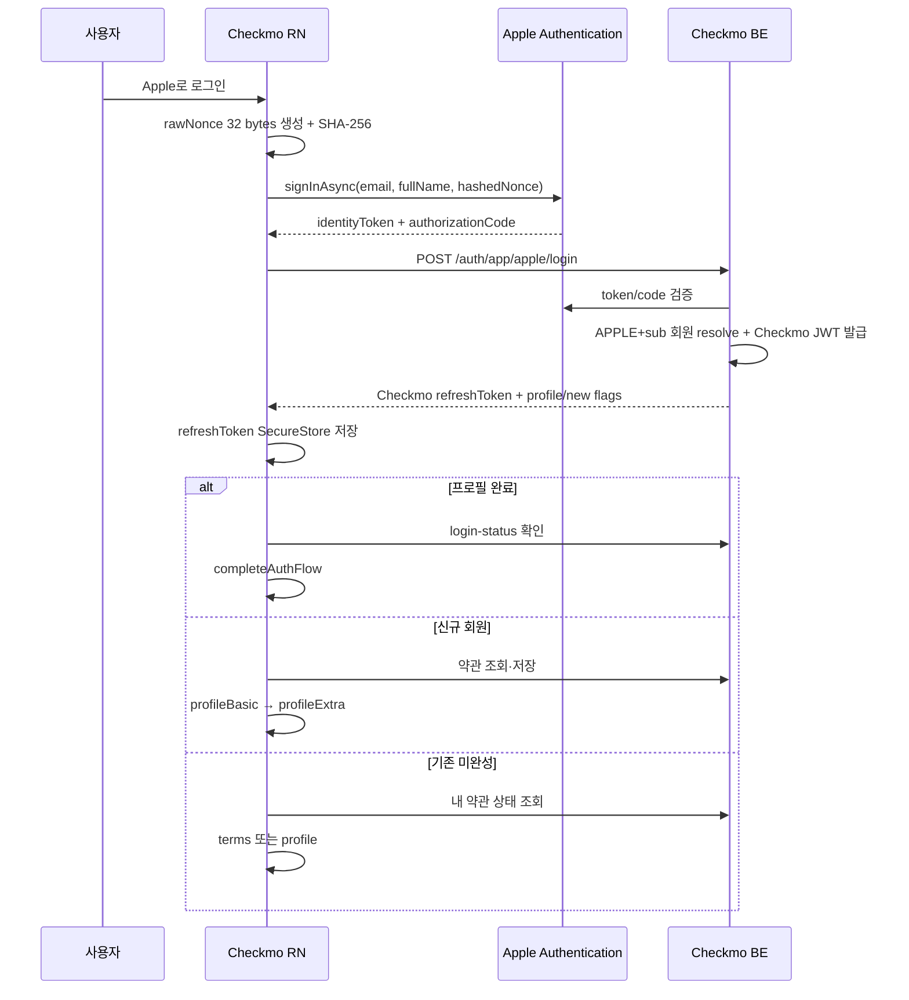

# Apple 로그인 React Native 구현 계획

> 작성 기준일: 2026-06-21 KST
> 기준 앱: Expo SDK 54 / React Native 0.81
> iOS Bundle ID: `kr.co.checkmo.app`
> 상태: 구현 대기

## 1. 목표와 범위

현재 이메일·닉네임 로그인 화면에 Apple 네이티브 로그인을 추가하고 Apple credential을 Checkmo 앱 세션으로 교환한다.

- Apple 버튼은 RN iOS에서만 제공한다.
- Android와 Expo Web에는 버튼·빈 여백·Apple API 호출을 만들지 않는다.
- iOS는 `expo-apple-authentication`의 시스템 버튼과 인증 화면을 사용한다.
- RN은 Apple ID Token을 신뢰해 직접 회원을 만들지 않고 백엔드에 검증을 위임한다.
- RN에는 Apple token/code/user ID를 저장하지 않고 Checkmo refresh token만 SecureStore에 저장한다.
- 신규 Apple 회원은 약관 저장 후 프로필을 완성한다.
- 기존 프로필 미완성 회원은 서버 약관 상태에 따라 terms 또는 profile로 이동한다.

## 2. 현재 RN 인증 구조 조사 결과

### 로그인 API

- `loginByIdentifier()`가 `POST /auth/app/login`을 호출한다.
- 응답 `refreshToken`이 없으면 `MISSING_REFRESH_TOKEN`으로 실패한다.
- Checkmo refresh token은 `authTokenStore`를 통해 SecureStore에 저장한다.
- `silentRefreshSession()`이 `/auth/app/refresh`로 token을 회전한다.

### AuthGate

- 상태는 `loggedOut`, `profileIncomplete`, `loggedIn` 세 가지다.
- 앱 시작 시 login-status를 조회하고 401이면 SecureStore refresh를 시도한다.
- `AUTH_403`이면 `profileCompletion` mode로 `AuthFlowScreen`을 연다.
- 약관 재동의 상태는 아직 없으며 [약관 RN 계획](./(done)terms-agreement-rn-plan.md)에서 `termsAgreement` mode를 추가하도록 정의돼 있다.

### 로그인·가입 화면

- `AuthFlowScreen` 하나가 login, terms, email verification, password, profile, complete 단계를 관리한다.
- `handleLogin()`은 로그인 후 login-status를 확인하고 완료 시 `completeAuthFlow()`를 호출한다.
- 현재 `enterProfileCompletionFlow()`는 바로 `profileBasic`으로 이동한다.
- 현재 terms의 다음 버튼은 항상 email verification으로 이동하므로 소셜 전용 분기가 필요하다.
- terms checkbox는 현재 로컬 state이며 서버 저장은 약관 계획의 API 연동이 선행돼야 한다.

## 3. 전체 iOS 흐름



## 4. 패키지와 네이티브 설정

### 설치

```bash
npx expo install expo-apple-authentication expo-crypto
```

- `expo-apple-authentication`: iOS 시스템 Apple 인증과 공식 버튼
- `expo-crypto`: 안전한 난수와 SHA-256
- Expo SDK가 선택한 호환 버전을 사용하며 임의 최신 버전을 고정하지 않는다.

### `app.json`

기존 설정을 유지하면서 다음을 추가한다.

```json
{
  "expo": {
    "ios": {
      "bundleIdentifier": "kr.co.checkmo.app",
      "usesAppleSignIn": true
    },
    "plugins": [
      "expo-apple-authentication"
    ]
  }
}
```

실제 plugins 배열에는 image-picker, font, secure-store, datetimepicker를 유지한다.

### entitlement

prebuild/EAS 후 `ios/app/app.entitlements`에 다음 값이 있어야 한다.

```xml
<key>com.apple.developer.applesignin</key>
<array>
  <string>Default</string>
</array>
```

현재 entitlement는 빈 dict이므로 네이티브 재생성이 필요하다. App ID capability 변경으로 기존 provisioning profile이 무효화될 수 있어 EAS development/production credentials를 재생성한다. 이 변경은 OTA로 배포할 수 없고 새 바이너리가 필요하다.

### 개발 환경

- Expo Go의 Apple token audience는 standalone app과 다를 수 있으므로 API 완료 판정에 사용하지 않는다.
- EAS development build와 실제 iPhone을 기준으로 검증한다.
- simulator는 UI·취소 정도만 확인하고 credential state 최종 테스트는 실기기에서 수행한다.

## 5. 백엔드 API 계약

### 요청

```http
POST /api/v1/auth/app/apple/login
Content-Type: application/json
```

```json
{
  "identityToken": "eyJ...",
  "authorizationCode": "c...",
  "rawNonce": "32-byte-random-value"
}
```

세 필드는 모두 필수다. Apple credential에서 token/code가 `null`이면 API를 호출하지 않는다.

### 성공 응답

```json
{
  "isSuccess": true,
  "code": "COMMON_200",
  "message": "성공입니다.",
  "result": {
    "refreshToken": "checkmo-refresh-token",
    "isProfileCompleted": false,
    "isNewUser": true
  }
}
```

- `refreshToken`: Checkmo token이며 Apple refresh token이 아니다.
- `isProfileCompleted`: Checkmo 프로필 완료 여부
- `isNewUser`: 이번 요청에서 Checkmo 회원이 생성됐을 때만 true
- 기존 이메일 회원에 자동 연결한 경우 `isNewUser=false`

### 오류 계약

| HTTP | 코드 | RN 처리 |
| --- | --- | --- |
| 400 | `APPLE_AUTH_400` | `이 Apple 계정으로 로그인을 완료할 수 없습니다.` |
| 401 | `APPLE_AUTH_401` | `Apple 인증에 실패했습니다. 다시 시도해 주세요.` |
| 409 | `APPLE_AUTH_409` | `이미 다른 계정에 연결된 Apple 계정입니다.` |
| 502 | `APPLE_AUTH_502` | `Apple 로그인 서비스에 연결할 수 없습니다. 잠시 후 다시 시도해 주세요.` |
| 500 | `AUTH_500` | `Apple 로그인에 실패했습니다.` |

## 6. nonce 생성

매 로그인 요청마다 새 nonce를 만든다.

1. `Crypto.getRandomBytesAsync(32)`로 32바이트 난수 생성
2. lowercase hex 또는 base64url인 `rawNonce`로 인코딩
3. `Crypto.digestStringAsync(SHA256, rawNonce)`로 `hashedNonce` 생성
4. `hashedNonce`를 `signInAsync({ nonce })`에 전달
5. API에는 `rawNonce`를 전달
6. 함수 종료 후 두 값을 버리고 저장·로그하지 않음

```ts
const randomBytes = await Crypto.getRandomBytesAsync(32);
const rawNonce = bytesToHex(randomBytes);
const hashedNonce = await Crypto.digestStringAsync(
  Crypto.CryptoDigestAlgorithm.SHA256,
  rawNonce,
);
```

`Math.random()`, 고정값, timestamp 단독 nonce를 사용하지 않는다. byte-to-hex helper는 leading zero를 보존하고 테스트한다.

## 7. Apple credential 요청

```ts
const credential = await AppleAuthentication.signInAsync({
  requestedScopes: [
    AppleAuthentication.AppleAuthenticationScope.FULL_NAME,
    AppleAuthentication.AppleAuthenticationScope.EMAIL,
  ],
  nonce: hashedNonce,
});
```

- email/fullName은 최초 동의 때만 제공될 수 있다.
- RN이 `credential.email`을 회원 식별자나 신뢰 데이터로 사용하지 않는다.
- 실제 이메일 또는 relay 이메일 저장 여부는 백엔드 ID Token claim으로 결정한다.
- 재로그인은 백엔드 `APPLE + sub` 매핑이 담당한다.
- `credential.user`를 SecureStore에 별도 저장하지 않는다.

## 8. API 함수

`src/services/api/authApi.ts`에 타입과 함수를 추가한다.

```ts
export type AppleLoginPayload = {
  identityToken: string;
  authorizationCode: string;
  rawNonce: string;
};

export type AppleLoginResult = {
  isProfileCompleted: boolean;
  isNewUser: boolean;
};

export async function loginWithApple(
  payload: AppleLoginPayload,
): Promise<AppleLoginResult>;
```

구현 규칙:

- 기존 `requestJson<ApiEnvelope<...>>()`와 `unwrapResult()` 사용
- 내부 경로 `/auth/app/apple/login` 사용
- `result.refreshToken`을 검증한 뒤 `saveStoredRefreshToken()` 호출
- SecureStore 저장이 성공한 뒤에만 결과 반환
- token이 없으면 기존과 같은 `MISSING_REFRESH_TOKEN`
- `identityToken`, authorization code, nonce, Apple refresh token은 RN 저장소에 보관하지 않음

## 9. Apple 버튼 UI

### availability

로그인 화면 mount 시 iOS에서만 확인한다.

```ts
const available =
  Platform.OS === "ios" &&
  await AppleAuthentication.isAvailableAsync();
```

- 확인 전·실패·false이면 버튼을 숨긴다.
- 숨긴 자리에 빈 gap을 남기지 않는다.
- Android에서는 Apple module method를 호출하지 않는다.

### 시스템 버튼

```tsx
<AppleAuthentication.AppleAuthenticationButton
  buttonType={AppleAuthentication.AppleAuthenticationButtonType.SIGN_IN}
  buttonStyle={AppleAuthentication.AppleAuthenticationButtonStyle.BLACK}
  cornerRadius={8}
  style={styles.appleLoginButton}
  onPress={() => { void handleAppleLogin(); }}
/>
```

- 자체 SVG/Pressable로 Apple 버튼을 만들지 않는다.
- 현재 로그인 카드의 AppButton 폭과 맞춘다.
- Apple 권장 최소 크기와 주변 margin을 지킨다.
- 이메일 로그인 버튼 아래에 구분 문구와 함께 배치한다.
- loading 중 투명 overlay 또는 인접 문구로 재탭을 차단하되 시스템 버튼 내부를 변형하지 않는다.

## 10. 화면 상태와 handler

`AuthFlowScreen`에 다음 상태를 추가한다.

```ts
const [appleLoginAvailable, setAppleLoginAvailable] = useState(false);
const [appleLoginSubmitting, setAppleLoginSubmitting] = useState(false);
```

`handleAppleLogin()` 순서:

1. iOS/available 확인
2. `loginSubmitting || appleLoginSubmitting`이면 반환
3. `appleLoginSubmitting=true`
4. raw/hashed nonce 생성
5. `signInAsync()` 호출
6. identityToken/authorizationCode 존재 확인
7. `loginWithApple()` 호출
8. 성공 결과에 따라 onboarding 분기
9. finally에서 submitting 해제

취소 처리:

- `ERR_REQUEST_CANCELED`는 토스트 없이 종료
- 취소 시 Checkmo token 저장·화면 이동 없음
- 나머지 native error는 일반 실패 문구로 처리
- error 객체 전체를 console/Sentry에 기록하지 않고 정제된 code만 남김

## 11. 성공 후 분기

### 프로필 완료

```text
loginWithApple
→ fetchLoginStatusSilently(true)
→ 로그인 성공 토스트
→ completeAuthFlow()
```

후속 login-status까지 성공해야 `AuthGate`를 loggedIn으로 확정한다.

### 신규 Apple 회원

`isNewUser=true`, `isProfileCompleted=false`이면 인증된 소셜 가입 mode로 terms부터 시작한다.

```text
Apple 로그인 성공 및 Checkmo session 저장
→ 활성 약관 조회
→ 필수/선택 agreement 저장
→ profileBasic
→ profileExtra
→ additional-info
→ signupComplete
```

현재 terms 다음 버튼의 분기를 수정한다.

```text
일반 이메일 가입: terms → emailVerification
인증된 소셜 가입: terms → 약관 POST → profileBasic
```

소셜 가입에서는 이메일 인증과 password 단계를 절대 호출하지 않는다.

### 기존 프로필 미완성

`isNewUser=false`, `isProfileCompleted=false`이면 `GET /members/me/terms`를 먼저 조회한다.

- 필수 약관 부족: `termsAgreement`
- 약관 완료: `profileBasic`
- 약관 조회 실패: 진행 차단과 재시도, profile fallback 금지

신규 가입 중 앱이 종료돼 다음 로그인에서 `isNewUser=false`가 되더라도 서버 약관 상태가 terms를 복원한다.

## 12. AuthGate와 약관 우선순위

[약관 RN 계획](./(done)terms-agreement-rn-plan.md)의 상태 확장을 선행 적용한다.

```ts
type AuthPageMode = "login" | "termsAgreement" | "profileCompletion";
type AuthSessionState =
  | "loggedOut"
  | "termsIncomplete"
  | "profileIncomplete"
  | "loggedIn";
```

앱 시작·로그인 후 판정 순서:

1. Checkmo session 존재 확인/refresh
2. 내 활성 약관 상태 조회
3. 필수 약관 미동의면 termsIncomplete
4. 약관 완료 후 profile 상태 조회
5. profile 미완성이면 profileIncomplete
6. 모두 완료하면 loggedIn

`TERMS_403`은 세션 만료로 처리하거나 SecureStore token을 삭제하지 않는다. `AUTH_403`보다 약관 화면이 우선한다.

## 13. 로그아웃·탈퇴·권한 철회

### 일반 로그아웃

- 기존 `logoutSession()`으로 Checkmo refresh token과 쿠키 제거
- `AppleAuthentication.signOutAsync()` 호출 금지
- Apple authorization은 유지해 다음 로그인을 허용

### 회원탈퇴

- RN은 기존 withdrawal API 호출
- 성공 여부와 무관하게 최종 성공 시 Checkmo SecureStore token 삭제
- Apple client token revoke와 재시도는 백엔드 책임

### Apple 권한 철회

- 다음 Apple 로그인에서 backend 검증 실패 시 `APPLE_AUTH_401` 안내
- 로컬 Checkmo session이 이미 유효한 동안 매 화면에서 Apple credential state를 강제 조회하지 않음
- server-to-server notification/상시 credential state 감시는 이번 RN 범위 밖이며 후속 운영 항목으로 기록

## 14. 변경 대상

| 영역 | 대상 | 변경 |
| --- | --- | --- |
| dependency | `package.json`, lockfile | Apple Authentication/Crypto 추가 |
| Expo config | `app.json` | capability와 plugin |
| native iOS | entitlement/provisioning | Sign in with Apple 반영 |
| auth API | `authApi.ts` | Apple payload/response/token 저장 |
| 로그인 UI | `AuthFlowScreen.tsx` | availability, 공식 버튼, handler, 분기 |
| nonce helper | auth utility | random bytes, hex, digest |
| 인증 gate | `AuthGateContext.tsx` | terms 우선 상태 |
| 약관 연동 | terms API/flow | 소셜 약관 저장 후 profile 이동 |

Apple 로그인만을 위해 별도 전역 store를 만들지 않는다. 화면 상태는 `AuthFlowScreen`, 지속 세션은 기존 AuthGate/SecureStore가 소유한다.

## 15. 자동 검증

```bash
npm run typecheck
npm run lint
npx expo-doctor
npx expo run:ios
```

검증 항목:

- iOS 조건부 import/호출과 Android build 안전성
- nonce 32바이트, hex leading zero, SHA-256 형식
- token/code 누락 시 backend 미호출
- Checkmo refresh token 누락·SecureStore 실패 시 화면 미전환
- 취소 무음 처리와 오류 code 문구
- 완료/신규/기존 미완성 3분기
- termsIncomplete가 profileIncomplete보다 우선
- logout/withdrawal token 삭제
- config와 entitlement 일치

테스트 runner가 없는 현재 저장소에서는 nonce·성공 분기 helper를 순수 함수로 분리하고 typecheck 외 테스트 도입 여부를 구현 PR에서 명시한다.

## 16. 실기기 테스트

| 시나리오 | 기대 결과 |
| --- | --- |
| 실제 이메일 공개 최초 로그인 | 신규 회원, terms → profile |
| 이메일 가리기 최초 로그인 | relay email 신규 회원, terms → profile |
| 동일 Apple 재로그인 | 동일 회원, 중복 identity 없음 |
| 웹에서 가입한 Apple 계정 | 동일 Checkmo 회원으로 수렴 |
| 기존 Checkmo email 자동 연결 | 기존 프로필·데이터 유지 |
| Apple 모달 취소 | 토스트·API·session 변화 없음 |
| token/code 누락 | 안전한 오류, backend 미호출 |
| 앱 종료 후 신규 가입 재개 | 서버 약관 상태로 정확한 단계 복원 |
| access token 만료 | SecureStore refresh로 session 복원 |
| 앱 삭제·재설치 | Apple sub로 기존 회원 로그인 |
| Apple 권한 철회 | 인증 실패 안내, 다른 회원 오연결 없음 |
| 회원탈퇴 후 재가입 | backend 복구 정책과 일관된 결과 |
| Android 로그인 화면 | Apple 버튼과 빈 여백 없음 |

최종 판정은 실제 Bundle ID가 서명된 EAS development/TestFlight build에서 수행한다.

## 17. 배포·롤백

1. 약관 API와 backend Apple 앱 API를 먼저 배포한다.
2. development profile을 재생성하고 EAS development build를 만든다.
3. staging에서 신규/기존/relay/웹 교차 로그인을 검증한다.
4. production profile과 entitlement를 확인한다.
5. TestFlight 검증 후 App Store build를 제출한다.
6. `APPLE_AUTH_*`, native error, 가입 단계 이탈률을 관측한다.

문제 발생 시 remote feature flag가 있다면 Apple 버튼만 숨긴다. 없다면 긴급 OTA로 JS 버튼 노출을 막되 이미 배포된 native capability와 backend revoke 경로는 유지한다.

## 18. 완료 조건

- [ ] iOS에서만 Apple 공식 버튼이 표시된다.
- [ ] raw nonce/token/code 계약이 백엔드 문서와 일치한다.
- [ ] Checkmo refresh token만 SecureStore에 저장된다.
- [ ] 실제/relay 이메일 회원이 `APPLE + sub`로 재로그인한다.
- [ ] 신규 회원은 terms 저장 후 profile로 이동한다.
- [ ] 앱 재시작에서도 약관·프로필 우선순위가 복원된다.
- [ ] 취소·오류·중복 탭이 안전하게 처리된다.
- [ ] 자동 검증과 실기기 E2E가 통과한다.

## 19. 공식 자료

- [Expo - AppleAuthentication](https://docs.expo.dev/versions/latest/sdk/apple-authentication/)
- [Expo - Crypto](https://docs.expo.dev/versions/latest/sdk/crypto/)
- [Apple - Sign in with Apple](https://developer.apple.com/documentation/signinwithapple)
- [Apple - Verifying a user](https://developer.apple.com/documentation/signinwithapple/verifying-a-user)
- [Apple - Sign in with Apple HIG](https://developer.apple.com/design/human-interface-guidelines/sign-in-with-apple)
- [Apple TN3194 - Account deletion and token revocation](https://developer.apple.com/documentation/technotes/tn3194-handling-account-deletions-and-revoking-tokens-for-sign-in-with-apple)
