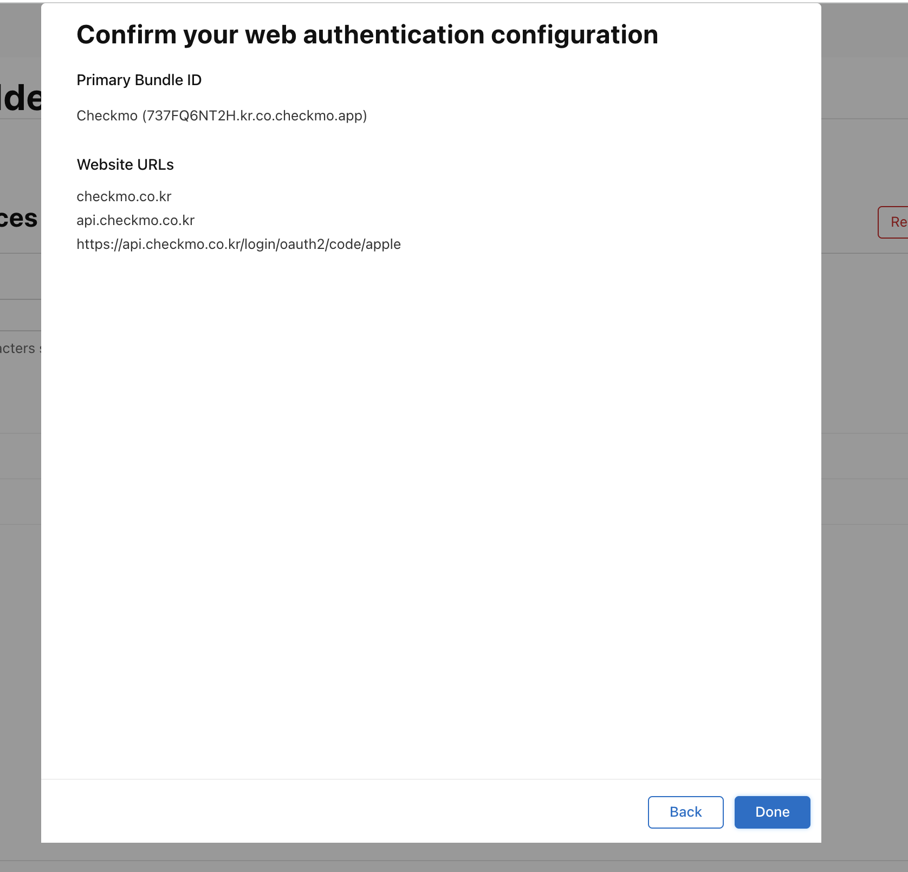
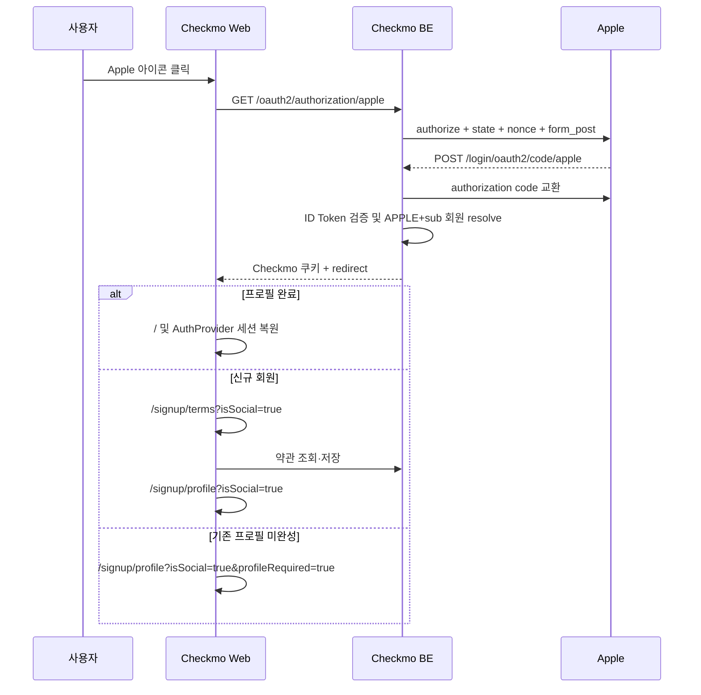

# Apple 로그인 웹 FE 구현 계획

> 작성 기준일: 2026-06-21 KST
> 기준 코드: `ref_code/FE` `fix-397-bug`
> 상태: 구현 대기

## 1. 목표와 범위

Checkmo 웹 로그인 모달의 기존 Google/Naver/Kakao OAuth redirect 흐름에 Apple을 추가한다.

- Apple 버튼은 기존 소셜 원형 아이콘 행에 추가한다.
- 브라우저는 백엔드 `/oauth2/authorization/apple`로 이동한다.
- Apple callback, token 교환, 회원 생성, Checkmo 쿠키 발급은 백엔드가 담당한다.
- Next.js callback API를 새로 만들지 않는다.
- 신규 Apple 회원은 약관을 저장한 다음 프로필을 완성한다.
- 현재 모든 소셜 로그인이 약관을 건너뛰는 FE 동작도 함께 바로잡는다.
- Apple identity/token/private key는 웹 JS에 노출하거나 저장하지 않는다.

## 2. Apple 웹 설정

| 항목 | 값 |
| --- | --- |
| Primary App ID | `kr.co.checkmo.app` |
| Services ID / Web client ID | `kr.co.checkmo.web` |
| Team ID | `737FQ6NT2H` |
| Domains | `checkmo.co.kr`, `api.checkmo.co.kr` |
| Return URL | `https://api.checkmo.co.kr/login/oauth2/code/apple` |



Return URL은 현재 Spring Security callback 패턴과 일치한다. 구현 전에는 실제 endpoint가 없어도 등록할 수 있으며, 백엔드 `apple` ClientRegistration이 배포되면 callback이 활성화된다.

## 3. 현재 웹 인증 구조 조사 결과

### 로그인 UI

- `constants/auth.ts`의 `SOCIAL_LOGINS`에는 google/naver/kakao 세 항목이 있다.
- `SocialLogin.tsx`는 항목마다 40x40 원형 버튼과 이미지를 렌더링한다.
- `LoginModal.tsx`는 이메일 폼 아래에 `SocialLogin`을 배치한다.
- 모바일 모달은 폭 290px, 태블릿 이상은 379px이므로 네 아이콘의 폭·gap 검증이 필요하다.

### OAuth 시작

`useLoginForm.handleSocialLogin()`은 provider별 공개 환경변수를 읽고 `window.location.href`로 이동한다.

```text
google → NEXT_PUBLIC_GOOGLE_AUTH_URL
kakao  → NEXT_PUBLIC_KAKAO_AUTH_URL
naver  → NEXT_PUBLIC_NAVER_AUTH_URL
```

Apple도 동일한 방식으로 추가한다.

### 세션 복원

- 백엔드가 HttpOnly Checkmo JWT 쿠키를 발급한다.
- `AuthProvider`가 `/members/me`로 세션과 프로필을 복원한다.
- 프로필 미완성 403이면 `/members/me/login-status`로 최소 회원 정보를 복원한다.
- Zustand는 UI 상태만 관리하며 Apple credential을 저장하지 않는다.

### 현재 소셜 약관 버그

백엔드는 신규 소셜 회원을 `/signup/terms?isSocial=true`로 보내지만 `SignupStepPageClient`는 다음 조건으로 바로 profile로 치환한다.

```ts
if (step === "terms" || step === "email" || step === "password") {
  router.replace(PROFILE_COMPLETION_ROUTE);
}
```

또한 `AuthProvider`의 허용 경로는 profile/profile-image뿐이라 `/signup/terms`에서 프로필 완성 모달이 약관 화면을 덮을 수 있다. Apple 추가 시 이 두 동작을 공통 소셜 가입 규칙에 맞게 수정한다.

## 4. 전체 웹 흐름



웹은 Apple response를 직접 파싱하지 않는다. URL query 또는 localStorage에 ID Token/code를 보관하지 않는다.

## 5. 환경변수와 provider 타입

`ref_code/FE/.env`의 기존 provider 설정 옆에 추가한다.

```dotenv
NEXT_PUBLIC_APPLE_AUTH_URL=https://api.checkmo.co.kr/oauth2/authorization/apple
```

- `NEXT_PUBLIC_` 값에는 로그인 시작 URL만 둔다.
- Team ID, Key ID, Services ID secret, `.p8`, Apple client secret은 웹 환경변수에 넣지 않는다.
- 사용하지 않는 `NEXT_PUBLIC_*_CALLBACK_URL` 패턴을 Apple에 새로 만들지 않는다. callback은 백엔드가 받는다.

provider 문자열은 가능한 경우 다음 union으로 고정한다.

```ts
export type SocialLoginProvider = "google" | "naver" | "kakao" | "apple";
```

`SocialLoginProps.onSocialLogin`과 handler 인자를 이 타입으로 바꿔 default 누락을 컴파일 단계에서 찾는다.

## 6. Apple 버튼

### 상수와 에셋

```ts
export const SOCIAL_LOGINS = [
  { name: "google", icon: "/googleLogo.svg", alt: "구글 로그인" },
  { name: "naver", icon: "/naverLogo.svg", alt: "네이버 로그인" },
  { name: "kakao", icon: "/kakaotalk.svg", alt: "카카오 로그인" },
  { name: "apple", icon: "/appleLogo.svg", alt: "Apple로 로그인" },
] as const;
```

- Apple이 제공하는 공식 검정 로고를 사용한다.
- 로고를 늘이거나 색을 임의 변경하지 않는다.
- 원형 버튼의 접근성 이름은 `Apple로 로그인`으로 제공한다.
- 다른 provider와 같은 크기·disabled·focus-visible 상태를 적용한다.

### 레이아웃

기존 `gap-6`에서 네 아이콘은 모바일 내부 폭을 초과할 수 있으므로 다음 기준을 적용한다.

- 한 줄 4개 유지
- 버튼 40px 유지
- 모바일 gap은 12~16px 범위에서 기존 토큰과 맞춤
- 태블릿 이상 기존 여백과 시각 균형 유지
- 320px viewport, 브라우저 zoom 200%, 긴 locale에서 잘림 확인
- 로딩 시 네 버튼 전체를 비활성화

아이콘 행을 두 줄로 나누거나 Apple만 별도 full-width 버튼으로 만들지 않는다.

## 7. OAuth 시작 처리

`handleSocialLogin`에 Apple을 추가한다.

```ts
case "apple":
  authUrl = process.env.NEXT_PUBLIC_APPLE_AUTH_URL || "";
  break;
```

동작 규칙:

1. 이메일 로그인 submit 중이면 소셜 버튼을 막는다.
2. URL이 없으면 기존 `로그인 주소 설정이 누락되었습니다.` 토스트를 사용한다.
3. URL이 있으면 `window.location.assign(authUrl)` 또는 기존 `href` 방식으로 전체 페이지 이동한다.
4. FE에서 state/nonce를 생성하지 않는다. 백엔드 Spring Security가 소유한다.
5. 팝업 OAuth로 변경하지 않는다. 기존 provider와 동일한 full redirect를 유지한다.

## 8. 성공 redirect와 가입 분기

### 완료 회원

백엔드가 `/`로 redirect한다. `AuthProvider`가 쿠키로 프로필을 복원하고 기존 `login()`을 호출한다. Apple 전용 callback page나 store action은 필요 없다.

### 신규 소셜 회원

백엔드가 `/signup/terms?isSocial=true`로 redirect한다.

`SignupStepPageClient` 변경:

- `isSocial=true`에서 `terms`는 허용한다.
- `email`, `password`만 profile로 우회한다.
- 약관 저장 성공 후 `profile`로 이동한다.
- provider email은 backend session/profile status에서 가져오고 query email을 신뢰하지 않는다.

목표 조건:

```ts
if (isSocial && (step === "email" || step === "password")) {
  router.replace("/signup/profile?isSocial=true");
}
```

### 기존 프로필 미완성 회원

백엔드는 `/signup/profile?isSocial=true&profileRequired=true`로 보낸다. 이미 신규 가입 때 약관을 저장한 회원이므로 약관을 무조건 다시 보여주지 않는다. 서버 `GET /members/me/terms`에서 필수 미동의가 확인되는 경우에만 약관 재동의 화면을 우선한다.

## 9. 약관 게이트 연동

구체적 API와 데이터 모델은 아래 문서를 따른다.

- [약관 백엔드 계획](./(done)terms-agreement-backend-plan.md)
- [약관 웹 계획](./(done)terms-agreement-fe-plan.md)

Apple 구현에서 반드시 반영할 연결점:

1. `/signup/terms`를 인증된 onboarding 허용 경로로 취급한다.
2. `AuthProvider`는 세션 복원 후 약관 상태를 프로필보다 먼저 판단한다.
3. 필수 약관 부족이면 terms, 약관 완료+프로필 미완성이면 profile로 이동한다.
4. 약관 GET 실패를 프로필 직행으로 fallback하지 않는다.
5. `TERMS_403`은 로그아웃이 아니라 약관 화면 이동으로 처리한다.
6. 신규 Apple 가입의 agreement 저장 전 `additional-info`를 호출하지 않는다.

이 규칙은 Apple만의 분기가 아니라 Google/Kakao/Naver에도 동일하게 적용한다.

## 10. OAuth 실패 UX

백엔드는 다음처럼 민감정보 없는 public code로 웹에 보낸다.

```text
https://checkmo.co.kr/?authError=APPLE_AUTH_FAILED
```

공용 client handler를 두어:

1. `authError` query 확인
2. 허용된 code를 사용자 문구로 매핑
3. toast 1회 표시
4. `router.replace()`로 query 제거
5. 알 수 없는 값은 일반 소셜 로그인 실패 문구 사용

권장 문구:

| code | 문구 |
| --- | --- |
| `APPLE_AUTH_CANCELED` | 토스트 없음 또는 로그인 취소 안내 |
| `APPLE_AUTH_FAILED` | `Apple 로그인에 실패했습니다. 다시 시도해 주세요.` |
| `APPLE_AUTH_CONFLICT` | `이미 다른 계정에 연결된 Apple 계정입니다.` |
| `APPLE_AUTH_UNAVAILABLE` | `Apple 로그인 서비스에 연결할 수 없습니다.` |

서버 exception message, email, state, code를 query에 넣지 않는다.

## 11. 세션·로그아웃·계정 화면

- Apple 로그인 완료 후에도 기존 `/members/me`와 Zustand 상태를 사용한다.
- 일반 로그아웃은 `/auth/logout`으로 Checkmo 쿠키만 제거한다.
- 브라우저에서 Apple revoke/sign-out을 호출하지 않는다.
- 회원탈퇴 시 FE는 기존 withdrawal API만 호출하고 Apple revoke는 백엔드에 맡긴다.
- 계정 상태 카드에서 신규 `APPLE_*` 회원은 `APPLE`로 표시할 수 있도록 provider 타입·스타일을 확장한다.
- 기존 LOCAL 회원에 Apple이 연결된 경우 현재 단일 provider 응답은 LOCAL을 유지한다. 복수 연결 UI는 별도 범위다.

## 12. 변경 대상

| 영역 | 대상 | 변경 |
| --- | --- | --- |
| 환경 | 배포 env/example | Apple auth 시작 URL 추가 |
| 상수·타입 | auth constants/types | Apple provider와 공식 icon 추가 |
| 로그인 UI | `SocialLogin`, `LoginModal` | 네 번째 원형 버튼과 responsive gap |
| 로그인 handler | `useLoginForm` | Apple URL 분기 |
| 소셜 onboarding | `SignupStepPageClient` | terms skip 제거, 기존 미완성 분리 |
| 인증 gate | `AuthProvider`, profile helper | terms 우선순위와 허용 경로 |
| 오류 UX | 공용 callback query handler | 공개 오류 toast와 query 정리 |
| 계정 설정 | provider 표시 컴포넌트 | APPLE 표시 추가 |

참조 FE의 현재 dirty 파일 `comment_section_notice.tsx`는 Apple 작업과 무관하므로 수정하거나 되돌리지 않는다.

## 13. 자동 검증

```bash
npm run lint
npm run build
```

확인 항목:

- provider union과 Apple switch 누락 없음
- `NEXT_PUBLIC_APPLE_AUTH_URL` 미설정 빌드/런타임 안내
- 서버 component에서 `window` 접근 없음
- 네 버튼 접근성 이름과 button type
- OAuth 오류 query 처리 후 무한 toast/replace 없음
- `/signup/terms`와 `/signup/profile` redirect loop 없음
- 약관 미동의가 profile보다 우선

테스트 인프라를 추가하지 않는다면 redirect/branch 로직을 작은 순수 helper로 분리해 최소 단위 테스트가 가능한 형태로 설계한다.

## 14. 브라우저 E2E 체크리스트

### Apple 로그인

- Safari/Chrome 데스크톱에서 실제 이메일 공개 신규 가입
- 이메일 가리기 신규 가입과 relay email 표시
- 같은 Apple 계정 재로그인 시 동일 Checkmo 회원
- iOS 앱에서 가입한 Apple 계정의 웹 로그인 수렴
- 기존 Checkmo 이메일과 같은 Apple email 자동 연결
- Apple 취소, state 만료, callback 재전송, provider 장애

### 가입·세션

- 신규 Apple: 약관 → 프로필 → 완료 → 홈
- 새로고침·뒤로가기 후 약관/프로필 우선순위 유지
- 기존 프로필 미완성: 약관 중복 없이 profile
- 현재 필수 약관이 부족한 기존 회원: terms 우선
- 로그아웃 후 쿠키·Zustand 상태 초기화

### UI

- 320/375px 모바일 모달에서 네 아이콘 한 줄 유지
- tablet/desktop 정렬
- keyboard focus, Enter, screen reader label
- loading 중 중복 클릭 차단

## 15. 배포·롤백

1. 백엔드 Apple callback과 약관 API가 먼저 배포돼야 한다.
2. 운영 환경변수에 Apple 시작 URL을 추가한다.
3. staging에서 callback/domain/cookie를 확인한다.
4. 웹을 배포하고 신규/기존/relay E2E를 수행한다.
5. 성공률과 `authError` code를 관측한다.

문제가 있으면 `SOCIAL_LOGINS` feature flag 또는 환경 설정으로 Apple 버튼만 숨긴다. 기존 provider와 이메일 로그인은 그대로 유지하며 Apple callback/revoke backend는 기존 회원을 위해 제거하지 않는다.

## 16. 완료 조건

- [ ] Apple 원형 버튼이 기존 로그인 모달에 일관되게 표시된다.
- [ ] 클릭 시 `/oauth2/authorization/apple`로 이동한다.
- [ ] 웹 JS에 Apple credential이나 secret이 노출되지 않는다.
- [ ] 신규 소셜 회원 전체가 약관을 저장한 뒤 profile로 이동한다.
- [ ] 기존 프로필 미완성·재동의 분기가 redirect loop 없이 동작한다.
- [ ] Apple 실패가 안전한 사용자 문구로 표시된다.
- [ ] lint/build와 브라우저 E2E가 통과한다.

## 17. 공식 자료

- [Apple - Configure Sign in with Apple for the web](https://developer.apple.com/help/account/capabilities/configure-sign-in-with-apple-for-the-web/)
- [Apple - Sign in with Apple JS](https://developer.apple.com/documentation/signinwithapplejs)
- [Apple - Usage guidelines for websites and other platforms](https://developer.apple.com/sign-in-with-apple/usage-guidelines-for-websites-and-other-platforms/)
- [Apple - Sign in with Apple HIG](https://developer.apple.com/design/human-interface-guidelines/sign-in-with-apple)
