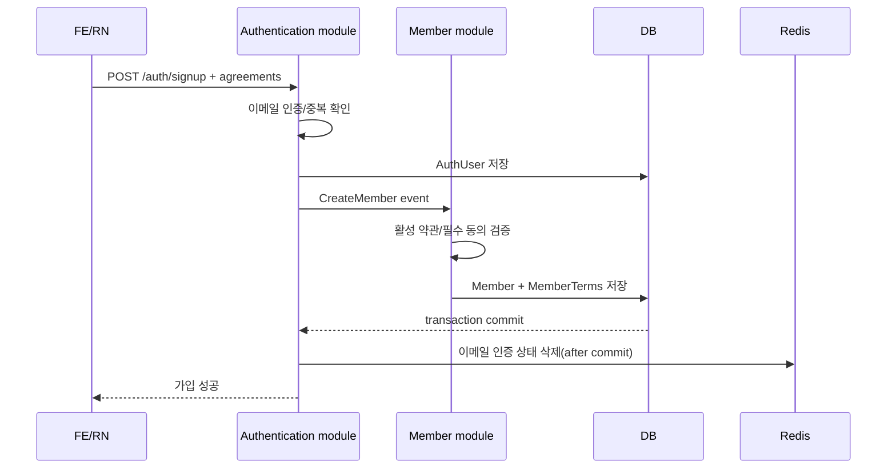

# 약관 동의 매핑 백엔드 구현 계획

> 작성 기준일: 2026-06-21 KST
> 기준 코드: `ref_code/BE`
> 연동 클라이언트: 웹 FE, React Native 앱
> 상태: 구현 대기
> 계약 원본: 이 문서

## 1. 목적과 범위

회원가입 화면에만 존재하던 약관 체크 상태를 백엔드가 검증하고, 회원이 실제로 확인한 약관 버전과 동의·미동의·철회 시각을 DB에 남긴다.

- 이메일 신규 가입은 회원 생성과 약관 기록을 하나의 트랜잭션으로 처리한다.
- 소셜 신규 가입은 소셜 인증으로 생성된 미완성 회원이 약관에 동의한 뒤 프로필을 완성하게 한다.
- 기존 회원은 임의 백필하지 않고 다음 로그인에서 현재 필수 약관에 직접 재동의한다.
- 선택 약관은 설정 화면에서 철회·재동의할 수 있다.
- 약관 본문은 웹의 버전 고정 URL이 원본이며 BE는 본문을 저장하지 않는다.
- 관리자 약관 CRUD는 이번 범위에서 제외하고 Flyway migration으로 버전을 배포한다.

## 2. 현재 코드 조사 결과

### DB와 엔티티

- `V20260120_1__create_terms_table.sql`에 `terms`, `member_terms`가 이미 있지만 임시 구조다.
- `terms`에는 `term_url`, `is_required`만 있고 종류, 제목, 버전, 활성 상태, 감사 시각이 없다.
- `member_terms`에는 동의 시각이 없고 `member_id`, `terms_id`가 nullable이다.
- `Terms`, `MemberTerms` 엔티티는 존재하지만 repository와 저장 service가 없다.
- 두 엔티티 모두 `BaseEntity`를 상속하지 않아 `created_at`, `updated_at`이 생성되지 않는다.

### 이메일 가입

현재 흐름은 다음과 같다.

```text
POST /api/v1/auth/signup
→ AuthUserCommandService.signUp()
→ AuthUser 저장
→ AuthenticationEvent.CreateMember 발행
→ MemberEventListener
→ MemberCommandService.createMember()
```

- `AuthRequestDTO.SignUp`에는 이메일과 비밀번호만 있다.
- `AuthenticationEvent.CreateMember`에는 회원 ID와 이메일만 있다.
- `AuthUserCommandService`, `MemberCommandService` 양쪽에 약관 TODO만 남아 있다.
- 이벤트 listener가 `Propagation.MANDATORY`로 동작하므로 agreement payload를 이벤트에 추가하면 AuthUser, Member, MemberTerms를 같은 DB 트랜잭션에서 저장할 수 있다.
- 현재 이메일 인증 Redis key를 이벤트 발행 전에 삭제한다. 약관 검증이나 Member 저장이 실패하면 DB는 롤백되지만 Redis 상태는 복구되지 않는 문제가 있다.

### 소셜 가입과 접근 제어

- `CustomOAuth2UserService`는 신규 소셜 회원을 만들고 agreement 없는 `CreateMember` 이벤트를 발행한다.
- `OAuth2AuthenticationSuccessHandler`는 프로필 미완성 회원을 `/signup/terms?isSocial=true`로 보낸다.
- `ProfileCompletionAuthorizationFilter`는 프로필 미완성 회원의 일반 API를 차단하고 일부 onboarding API만 허용한다.
- 약관 조회·저장 경로가 예외 목록에 없고, `additional-info` 전에 필수 약관을 검증하지 않는다.

## 3. 핵심 규칙

1. `terms.id`는 약관 종류가 아니라 **특정 약관 버전**의 식별자다.
2. `terms_type + version`은 유일해야 한다.
3. 공개된 약관 행에서는 `terms_type`, `title`, `term_url`, `version`, `is_required`를 수정하지 않는다.
4. 새 약관은 새 행으로 추가하고 같은 종류의 이전 행만 비활성화한다.
5. `member_terms`는 append-only다. 기존 행을 수정하거나 삭제하지 않는다.
6. 현재 상태는 `(member_id, terms_id)`의 `created_at DESC, id DESC` 첫 행으로 판단한다.
7. 기존 회원에게 동의 기록을 추정하여 `true`로 채우지 않는다.
8. 필수 약관이 하나라도 미동의이면 가입·프로필 완료·일반 API 접근을 허용하지 않는다.
9. 선택 약관 미동의는 가입을 막지 않는다.
10. 탈퇴 후 최종 회원 삭제 시 `member_terms`는 회원과 함께 삭제하고 `terms` 원본은 보존한다.

## 4. 데이터 모델

### 4.1 약관 종류

```java
public enum TermsType {
    SERVICE_TERMS,
    PRIVACY_COLLECTION,
    THIRD_PARTY_PROVISION,
    MARKETING
}
```

API 표시 순서는 위 순서로 고정한다. DB ID나 조회 결과의 우연한 정렬에 의존하지 않는다.

### 4.2 목표 `terms` 스키마

| 필드 | 타입 | 제약조건 | 설명 |
| --- | --- | --- | --- |
| `id` | `BIGINT` | PK, AUTO_INCREMENT | 약관 버전별 ID |
| `terms_type` | `VARCHAR(50)` | NOT NULL | `TermsType` 문자열 |
| `title` | `VARCHAR(255)` | NOT NULL | 체크박스 노출 제목 |
| `term_url` | `VARCHAR(2048)` | NOT NULL | 변경하지 않는 버전별 URL |
| `version` | `INT` | NOT NULL, CHECK >= 1 | 종류별 버전 |
| `is_active` | `BIT(1)` | NOT NULL, DEFAULT 0 | 현재 동의 대상 여부 |
| `is_required` | `BIT(1)` | NOT NULL | 필수 여부 |
| `created_at` | `DATETIME(6)` | NOT NULL | 생성 시각 |
| `updated_at` | `DATETIME(6)` | NOT NULL | 변경 시각 |

```sql
CREATE TABLE terms (
    id BIGINT NOT NULL AUTO_INCREMENT,
    terms_type VARCHAR(50) NOT NULL,
    title VARCHAR(255) NOT NULL,
    term_url VARCHAR(2048) NOT NULL,
    version INT NOT NULL,
    is_active BIT(1) NOT NULL DEFAULT b'0',
    is_required BIT(1) NOT NULL,
    created_at DATETIME(6) NOT NULL DEFAULT CURRENT_TIMESTAMP(6),
    updated_at DATETIME(6) NOT NULL DEFAULT CURRENT_TIMESTAMP(6)
        ON UPDATE CURRENT_TIMESTAMP(6),
    PRIMARY KEY (id),
    CONSTRAINT uq_terms_type_version UNIQUE (terms_type, version),
    CONSTRAINT chk_terms_version CHECK (version >= 1)
);
```

### 4.3 목표 `member_terms` 스키마

| 필드 | 타입 | 제약조건 | 설명 |
| --- | --- | --- | --- |
| `id` | `BIGINT` | PK, AUTO_INCREMENT | 동의 이벤트 ID |
| `member_id` | `VARCHAR(255)` | NOT NULL, FK | `member.id` |
| `terms_id` | `BIGINT` | NOT NULL, FK | 정확한 약관 버전 |
| `is_agreed` | `BIT(1)` | NOT NULL | 동의 true, 미동의·철회 false |
| `created_at` | `DATETIME(6)` | NOT NULL | 의사 표시 시각 |
| `updated_at` | `DATETIME(6)` | NOT NULL | 공통 감사 필드 |

```sql
CREATE TABLE member_terms (
    id BIGINT NOT NULL AUTO_INCREMENT,
    member_id VARCHAR(255) NOT NULL,
    terms_id BIGINT NOT NULL,
    is_agreed BIT(1) NOT NULL,
    created_at DATETIME(6) NOT NULL DEFAULT CURRENT_TIMESTAMP(6),
    updated_at DATETIME(6) NOT NULL DEFAULT CURRENT_TIMESTAMP(6)
        ON UPDATE CURRENT_TIMESTAMP(6),
    PRIMARY KEY (id),
    CONSTRAINT fk_member_terms_member
        FOREIGN KEY (member_id) REFERENCES member (id) ON DELETE CASCADE,
    CONSTRAINT fk_member_terms_terms
        FOREIGN KEY (terms_id) REFERENCES terms (id) ON DELETE RESTRICT,
    INDEX idx_member_terms_latest (
        member_id,
        terms_id,
        created_at DESC,
        id DESC
    )
);
```

`UNIQUE(member_id, terms_id)`는 추가하지 않는다. 같은 약관 버전에 대한 동의, 철회, 재동의를 각각 새 행으로 보존해야 한다.

### 4.4 Flyway migration 절차

기존 테이블을 DROP/CREATE하지 않고 ALTER한다.

1. 배포 전 운영 DB에서 `terms`, `member_terms` 행 수를 확인한다.
2. 데이터가 있으면 배포를 중단하고 출처를 확인한다. 기존 체크 UI를 근거로 동의를 자동 생성하거나 추정하지 않는다.
3. `terms.term_url` 길이를 2048로 확장한다.
4. `terms_type`, `title`, `version`, `is_active`, timestamp 컬럼을 추가한다.
5. `member_terms.member_id`, `terms_id`를 NOT NULL로 변경하고 timestamp를 추가한다.
6. 기존 FK를 명시된 DELETE 정책으로 재생성하고 최신 상태 조회 index를 추가한다.
7. 웹의 버전 고정 문서가 먼저 배포된 것을 확인한 뒤 v1 네 행을 seed한다.

초기 seed 기준:

| `terms_type` | `title` | `term_url` | version | required |
| --- | --- | --- | ---: | :---: |
| `SERVICE_TERMS` | 책모 이용약관 동의 | `https://www.checkmo.co.kr/support/terms/service/v1` | 1 | true |
| `PRIVACY_COLLECTION` | 서비스 이용을 위한 개인정보 수집·이용 동의 | `https://www.checkmo.co.kr/support/terms/privacy-collection/v1` | 1 | true |
| `THIRD_PARTY_PROVISION` | 개인정보 제3자 제공 동의 | `https://www.checkmo.co.kr/support/terms/third-party-provision/v1` | 1 | false |
| `MARKETING` | 마케팅 및 이벤트 정보 수신 동의 | `https://www.checkmo.co.kr/support/terms/marketing/v1` | 1 | false |

모든 seed는 `is_active=true`로 시작한다. 향후 v2 migration은 같은 트랜잭션 안에서 해당 type의 v1을 비활성화하고 v2를 삽입한다.

## 5. 엔티티와 repository

### `Terms`

- `BaseEntity`를 상속한다.
- `termsType`은 `@Enumerated(EnumType.STRING)`을 사용한다.
- 공개 후 수정 가능한 필드는 `isActive`뿐이다.
- runtime 관리자 CRUD와 임의 삭제 메서드는 제공하지 않는다.

### `MemberTerms`

- `BaseEntity`를 상속한다.
- 기존 `Member`, `Terms` 연관관계를 유지하되 두 FK를 nullable=false로 바꾼다.
- 동의 상태를 변경하는 setter/update 메서드를 만들지 않는다.
- 동의 상태 변경은 항상 새 엔티티 생성으로 처리한다.

### repository

`TermsRepository`:

- 활성 약관 전체 조회
- type별 활성 약관 조회
- ID 목록으로 활성 약관 조회
- 동일 type 활성 행 존재 확인

`MemberTermsRepository`:

- 회원과 활성 `terms_id` 목록에 대한 최신 이벤트 조회
- `(member_id, terms_id)` 최신 행 조회
- 회원의 agreement 이력 조회는 내부 감사·테스트 용도로만 제공

동시 POST 방지는 회원 행을 `PESSIMISTIC_WRITE`로 잠근 뒤 최신 상태를 조회하고, 최신 값과 요청 값이 다를 때만 새 이벤트를 삽입한다.

## 6. API 계약

모든 boolean JSON 필드명은 `@JsonProperty` 또는 명시적 record 이름으로 `isRequired`, `isAgreed`를 보장한다.

### 6.1 활성 약관 공개 조회

```http
GET /api/v1/terms
```

- 인증 없이 호출 가능하다.
- 활성 약관만 반환한다.
- `TermsType` 고정 순서로 정렬한다.
- 활성 약관이 type별로 둘 이상이면 조용히 하나를 선택하지 않고 서버 설정 오류로 보고한다.

```json
{
  "isSuccess": true,
  "code": "COMMON_200",
  "message": "성공입니다.",
  "result": {
    "terms": [
      {
        "termsId": 1,
        "termsType": "SERVICE_TERMS",
        "title": "책모 이용약관 동의",
        "termUrl": "https://www.checkmo.co.kr/support/terms/service/v1",
        "version": 1,
        "isRequired": true
      }
    ]
  }
}
```

### 6.2 내 활성 약관 상태 조회

```http
GET /api/v1/members/me/terms
Cookie: accessToken=...
```

프로필 미완성 회원도 호출할 수 있어야 한다.

```json
{
  "isSuccess": true,
  "result": {
    "requiresRequiredAgreement": true,
    "terms": [
      {
        "termsId": 1,
        "termsType": "SERVICE_TERMS",
        "title": "책모 이용약관 동의",
        "termUrl": "https://www.checkmo.co.kr/support/terms/service/v1",
        "version": 1,
        "isRequired": true,
        "isAgreed": false
      }
    ]
  }
}
```

기록 없음과 최신 false는 모두 API에서 `isAgreed=false`로 표현한다. DB 감사 이력에서는 두 상태를 구분할 수 있다.

### 6.3 내 약관 동의 저장·철회

```http
POST /api/v1/members/me/terms
Content-Type: application/json
Cookie: accessToken=...
```

```json
{
  "agreements": [
    { "termsId": 1, "isAgreed": true },
    { "termsId": 2, "isAgreed": true },
    { "termsId": 3, "isAgreed": false },
    { "termsId": 4, "isAgreed": false }
  ]
}
```

- onboarding·재동의 화면은 활성 약관 전체를 보낸다.
- 설정 화면은 변경할 선택 약관만 보낼 수 있다.
- 같은 `termsId`를 한 요청에 중복 전송하면 거부한다.
- 존재하지 않거나 비활성인 ID는 거부한다.
- 요청 반영 후 현재 활성 필수 약관이 모두 true인지 검증한다.
- 필수 약관 false 요청은 거부하며 어떤 이벤트도 저장하지 않는다.
- 최신 상태와 같은 요청은 성공 처리하되 새 행을 추가하지 않는다.
- 여러 agreement는 하나의 트랜잭션에서 모두 성공하거나 모두 롤백한다.

### 6.4 이메일 회원가입 변경

```http
POST /api/v1/auth/signup
```

```json
{
  "email": "member@example.com",
  "password": "Pass123!",
  "agreements": [
    { "termsId": 1, "isAgreed": true },
    { "termsId": 2, "isAgreed": true },
    { "termsId": 3, "isAgreed": false },
    { "termsId": 4, "isAgreed": false }
  ]
}
```

강제 활성화 후에는 활성 약관 전체가 정확히 한 번씩 포함되어야 한다. 선택 약관도 false로 명시하여 사용자가 화면을 거쳤음을 기록한다.

## 7. 오류 계약

`MemberErrorStatus`에 약관 전용 오류를 추가한다.

| HTTP | 코드 | 조건 | 클라이언트 처리 |
| --- | --- | --- | --- |
| 400 | `TERMS_400` | 빈 목록, 중복 ID, 잘못된 구조 | 약관을 다시 불러오고 입력 재확인 |
| 400 | `TERMS_401` | 필수 약관 미동의 | 필수 동의 안내 |
| 403 | `TERMS_403` | 최신 필수 약관 미동의 상태에서 일반 API 접근 | 재동의 화면으로 이동 |
| 409 | `TERMS_409` | 비활성·구버전·존재하지 않는 약관 제출 | 최신 약관 재조회 |

응답에는 회원 동의 전체 이력이나 다른 회원의 상태를 포함하지 않는다.

## 8. 이메일 가입 트랜잭션

`AuthRequestDTO.SignUp`에 `List<TermsAgreement>`를 추가하고 public event 계약에도 값 객체를 추가한다.

```java
public record TermsAgreement(Long termsId, boolean isAgreed) {}

public record CreateMember(
        String id,
        String email,
        List<TermsAgreement> agreements
) {}
```



약관 검증 또는 저장이 실패하면 AuthUser와 Member가 모두 롤백되어야 한다. Redis 인증 key 삭제는 `TransactionSynchronization.afterCommit` 등 commit 이후 처리로 이동한다.

## 9. 소셜 가입과 기존 회원 재동의

### 신규 소셜 회원

1. provider 인증 성공 후 AuthUser와 Member를 `profileCompleted=false`로 만든다.
2. JWT 세션을 발급하고 웹은 `/signup/terms?isSocial=true`로 이동한다.
3. 클라이언트가 `/members/me/terms`에 활성 약관 전체 상태를 저장한다.
4. 약관 저장 성공 후 프로필 입력으로 이동한다.
5. `additional-info`는 현재 필수 약관 동의를 다시 확인한 뒤 프로필 완료 처리한다.

소셜 인증 시점에는 아직 사용자의 약관 선택을 알 수 없으므로 빈 agreement로 Member를 만드는 것을 허용한다. 일반 서비스 접근과 프로필 완료는 약관 저장 전까지 허용하지 않는다.

### 기존 회원

- 기존 회원 agreement를 true로 백필하지 않는다.
- 로그인 또는 세션 복원 후 `/members/me/terms` 결과가 `requiresRequiredAgreement=true`이면 재동의한다.
- 새 필수 버전이 활성화되면 이전 버전 true는 새 버전에 승계되지 않는다.
- 기존 선택 약관 상태도 새 버전으로 자동 승계하지 않는다.

### 접근 게이트

Member module에 현재 회원의 필수 동의를 확인하는 MVC interceptor를 둔다. Authentication module이 Member internal service를 참조하지 않도록 Modulith 방향을 유지한다.

게이트 제외 경로:

- `/api/v1/terms/**`
- `/api/v1/members/me/terms/**`
- 로그인, 로그아웃, refresh 등 `/api/v1/auth/**`
- 회원가입에 필요한 이메일 인증·닉네임 확인
- 프로필 완성용 이미지 업로드
- `/health`, Swagger/OpenAPI, OAuth callback, WebSocket

`ProfileCompletionAuthorizationFilter`에도 `/api/v1/members/me/terms/**`를 예외로 추가한다. 필터를 우회해 `additional-info`를 직접 호출해도 command service의 필수 약관 검증으로 차단한다.

## 10. 단계적 강제 활성화

설정:

```yaml
checkmo:
  terms:
    enforcement-enabled: ${TERMS_ENFORCEMENT_ENABLED:false}
```

`@ConfigurationProperties(prefix = "checkmo.terms")` record로 바인딩한다.

`false` 호환 모드:

- GET/POST 약관 API와 agreement 저장은 정상 동작한다.
- agreement 없는 구버전 이메일 가입 요청을 임시 허용하고 누락을 구조화 로그로 집계한다.
- 일반 API의 `TERMS_403` 게이트는 적용하지 않는다.
- 새 FE/RN은 자체 상태 조회로 재동의 화면을 먼저 노출한다.

`true` 강제 모드:

- 이메일 가입에서 활성 약관 전체 제출을 필수화한다.
- 프로필 완료 전에 필수 동의를 검증한다.
- 기존 회원의 일반 API 접근을 `TERMS_403`으로 차단한다.

구버전 RN 사용량이 충분히 감소하기 전에 강제 모드를 켜지 않는다.

## 11. 선택 약관 철회·재동의

- 설정 화면의 `POST /members/me/terms`로 처리한다.
- true → false는 철회 이벤트, false/기록 없음 → true는 동의 이벤트다.
- 같은 상태 재전송은 새 이벤트를 만들지 않는다.
- 필수 약관 false 변경은 허용하지 않는다.
- 마케팅 발송 시스템은 최신 `MARKETING` 활성 버전의 현재 상태가 true인 회원만 대상으로 삼아야 한다.
- 철회 성공 응답 후 클라이언트가 즉시 최신 상태를 다시 조회할 수 있어야 한다.

## 12. 테스트 계획

### API 통합 테스트

- 활성 약관이 정해진 순서와 필드명으로 조회된다.
- 비활성 약관은 공개 목록에서 제외된다.
- 이메일 가입 시 필수 true·선택 false가 모두 저장된다.
- 필수 누락 또는 false 가입은 실패하고 AuthUser, Member, MemberTerms가 남지 않는다.
- 비활성·구버전 ID 가입은 `TERMS_409`다.
- 중복 ID 요청은 `TERMS_400`이다.
- 소셜/프로필 미완성 회원도 내 약관 조회·저장이 가능하다.
- 약관 미동의 상태의 `additional-info`는 실패한다.
- 선택 동의 → 철회 → 재동의가 세 개 이벤트로 저장된다.
- 같은 상태 재전송은 이벤트를 추가하지 않는다.
- 동시 요청에도 동일 상태 이벤트가 중복 생성되지 않는다.
- 기존 회원의 필수 미동의 상태에서 강제 모드 일반 API는 `TERMS_403`이다.
- 강제 모드가 꺼진 동안 구버전 가입 payload가 허용된다.
- 회원 hard delete 시 `member_terms`는 삭제되고 `terms`는 유지된다.

### 구조·migration 검증

```bash
./gradlew test --tests checkmo.authentication.AuthApiTest
./gradlew test --tests checkmo.member.MemberApiTest
./gradlew test --tests checkmo.CheckmoApplicationTests
./gradlew test --tests '*Api*'
./gradlew test
```

H2 테스트는 Flyway/MySQL 문법을 검증하지 않으므로 별도로 MySQL 임시 DB에서 migration을 처음부터 적용하고 `ddl-auto=validate` 기동까지 확인한다.

## 13. 배포 순서와 관측

1. 웹의 버전 고정 약관 URL 네 개를 먼저 배포한다.
2. 운영 DB legacy 테이블 행 수를 확인한다.
3. migration, seed, API를 `TERMS_ENFORCEMENT_ENABLED=false`로 배포한다.
4. 웹 FE를 배포하고 이메일·소셜 가입 agreement 저장을 확인한다.
5. RN 업데이트를 스토어에 배포한다.
6. agreement 없는 가입 요청, `TERMS_400/401/409`, 약관 API 실패율을 관측한다.
7. 지원 가능한 RN 버전 전환율을 확인한 뒤 강제 모드를 활성화한다.
8. `TERMS_403` 발생률과 재동의 완료율을 관측한다.

로그에는 `memberId`, `termsType`, version, 오류 코드만 남기고 이메일, 토큰, 약관 전체 본문은 기록하지 않는다.

## 14. 완료 조건

- 목표 schema와 v1 seed가 MySQL에서 정상 적용된다.
- 세 약관 API와 변경된 이메일 가입 계약이 OpenAPI에 노출된다.
- 이메일 가입에서 회원과 동의 기록이 원자적으로 저장된다.
- 신규 소셜 회원은 약관 동의 없이 프로필을 완료할 수 없다.
- 기존 회원은 강제 활성화 후 다음 로그인에서 재동의한다.
- 선택 약관의 동의·철회·재동의 이력이 append-only로 남는다.
- 과거 약관 행과 버전 URL은 삭제·변경되지 않는다.
- 호환 모드와 강제 모드 테스트가 모두 통과한다.

## 15. 법적 검토 경계

이 설계는 약관 버전, 동의 여부, 시각을 기술적으로 증빙한다. 법적 적합성은 다음 항목을 별도로 검토해야 한다.

- 개인정보 수집·이용 목적, 항목, 보유기간, 거부 권리와 불이익 표시
- 필수·선택 동의의 분리와 선택 미동의 시 서비스 제공 보장
- 제3자 제공 대상·목적·항목·보유기간의 구체성
- 마케팅 철회 방법과 처리 결과 안내
- 탈퇴 후 agreement 보유·파기 정책의 개인정보처리방침 반영
