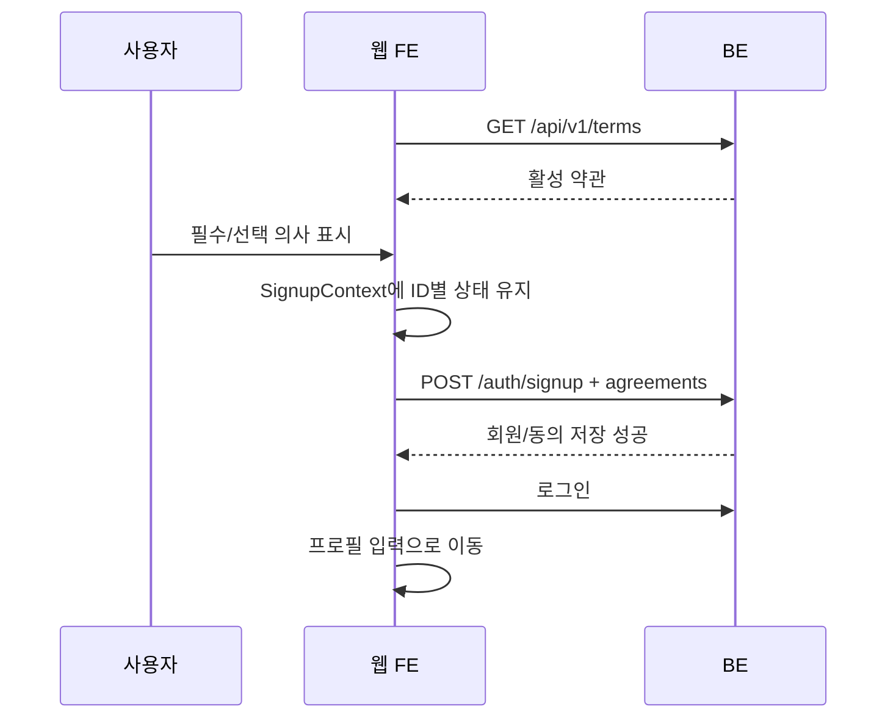

# 약관 동의 매핑 웹 FE 구현 계획

> 작성 기준일: 2026-06-21 KST
> 기준 코드: `ref_code/FE`
> 상태: 구현 대기
> BE 계약 원본: `docs/archive/(done)terms-agreement-backend-plan.md`

## 1. 목적과 범위

웹 회원가입의 하드코딩 약관을 BE 활성 약관 API로 교체하고, 이메일·소셜 가입과 기존 회원 재동의 결과를 DB에 저장한다. 설정 화면에서는 활성 약관 조회와 선택 약관 철회·재동의를 제공한다.

- 약관 본문은 버전 고정 웹페이지에서 제공한다.
- 가입 UI는 BE가 내려주는 ID, 제목, URL, 필수 여부를 사용한다.
- 이메일 가입은 signup payload에 모든 활성 약관 상태를 포함한다.
- 소셜 가입과 기존 회원 재동의는 인증된 내 약관 API를 사용한다.
- 약관 API 로딩 실패 시 하드코딩 fallback으로 가입시키지 않는다.

## 2. 현재 코드 조사 결과

### 회원가입 상태

- `SignupContext.agreements`는 `Record<string, boolean>`이고 `servicePrivacy`, `termsOfUse` 같은 FE 전용 문자열 key를 사용한다.
- `TermsAgreement`는 `TERMS_DATA`, `TERMS_CONTENT`를 사용해 목록과 본문을 모두 하드코딩한다.
- `PasswordEntry`는 `authService.signup({ email, password })`만 호출하므로 약관 선택이 서버로 전달되지 않는다.
- `SignupForm` 타입에도 agreement가 없다.

### 소셜 가입

- BE는 신규 소셜 회원을 `/signup/terms?isSocial=true`로 보낸다.
- `SignupStepPageClient`는 소셜 회원이 terms에 들어오면 바로 profile로 replace한다.
- 따라서 현재 소셜 가입은 약관 화면을 실제로 거치지 않는다.

### 약관 페이지

- `/support`에 약관 링크 목록이 있다.
- `/terms`, `/privacy`, `/third-party-consent`, `/marketing-consent` 페이지가 있지만 버전별 불변 URL은 아니다.
- 가입 약관과 설정 약관이 각각 다른 상수 파일을 사용해 내용이 중복된다.

## 3. FE 타입과 API 모듈

```ts
export type TermsType =
  | "SERVICE_TERMS"
  | "PRIVACY_COLLECTION"
  | "THIRD_PARTY_PROVISION"
  | "MARKETING";

export type ActiveTerm = {
  termsId: number;
  termsType: TermsType;
  title: string;
  termUrl: string;
  version: number;
  isRequired: boolean;
};

export type MemberTerm = ActiveTerm & {
  isAgreed: boolean;
};

export type TermAgreement = {
  termsId: number;
  isAgreed: boolean;
};

export type MemberTermsStatus = {
  requiresRequiredAgreement: boolean;
  terms: MemberTerm[];
};
```

API 모듈에 다음 함수를 추가한다.

```ts
fetchActiveTerms(): Promise<ActiveTerm[]>
fetchMyTermsStatus(): Promise<MemberTermsStatus>
saveMyTermsAgreements(agreements: TermAgreement[]): Promise<void>
```

endpoint:

```text
GET  /api/v1/terms
GET  /api/v1/members/me/terms
POST /api/v1/members/me/terms
```

`SignupForm`은 다음처럼 확장한다.

```ts
export interface SignupForm {
  email: string;
  password: string;
  agreements: TermAgreement[];
}
```

## 4. 회원가입 상태 구조

`SignupContext`에 서버 약관과 로딩 상태를 둔다.

```ts
terms: ActiveTerm[];
agreements: Record<number, boolean>;
termsStatus: "idle" | "loading" | "ready" | "error";
```

동작 규칙:

- terms 단계 최초 진입 시 `fetchActiveTerms()`를 호출한다.
- 응답 ID를 기준으로 모든 agreement를 false로 초기화한다.
- 화면 재진입 시 동일한 active terms 집합이면 기존 선택을 유지한다.
- 서버 목록이 바뀌었으면 존재하지 않는 ID 상태를 제거하고 새 ID를 false로 추가한다.
- 필수 약관이 전부 true일 때만 다음 버튼을 활성화한다.
- 전체 동의는 현재 활성 약관 전체만 토글한다.
- API 실패 시 체크 UI와 다음 버튼을 비활성화하고 명시적 재시도 버튼을 제공한다.

문자열 key인 `servicePrivacy`, `termsOfUse`, `thirdParty`, `marketing`은 가입 상태에서 제거한다.

## 5. 약관 상세 보기

목록에는 BE의 `title`을 표시한다. 제목 클릭 시 `termUrl`을 새 탭으로 연다.

```ts
window.open(term.termUrl, "_blank", "noopener,noreferrer");
```

- 상세 페이지를 열어도 SignupContext 상태는 유지한다.
- URL이 없거나 HTTPS가 아니면 열지 않고 오류 toast를 표시한다.
- 사용자가 상세 페이지를 열었다는 사실만으로 동의 처리하지 않는다.
- 체크박스 또는 상세 확인 후 동의 버튼을 눌렀을 때만 agreement를 true로 바꾼다.

기존 `TERMS_CONTENT`는 가입 UI 원본으로 사용하지 않는다. 버전 고정 공개 페이지의 콘텐츠 구성에만 재사용할 수 있다.

## 6. 이메일 가입 흐름



`PasswordEntry`에서 다음 배열을 만든다.

```ts
const agreementPayload = terms.map((term) => ({
  termsId: term.termsId,
  isAgreed: agreements[term.termsId] === true,
}));
```

- 활성 약관 전부를 전송한다.
- 선택하지 않은 선택 약관도 false로 전송한다.
- signup 중 `TERMS_409`가 발생하면 terms로 돌아가 목록을 다시 불러오고 기존 ID 선택을 폐기한다.
- `TERMS_400`, `TERMS_401`은 필수 동의 안내 후 terms로 이동한다.

## 7. 소셜 가입 흐름

`SignupStepPageClient`의 현재 동작을 변경한다.

- `isSocial=true`여도 terms를 건너뛰지 않는다.
- email, password 단계만 소셜 가입에서 생략한다.
- terms 다음 버튼에서 `saveMyTermsAgreements()`를 호출한다.
- 저장 성공 후 profile로 이동한다.
- 저장 실패 시 profile로 이동하지 않는다.
- 프로필 미완성 기존 소셜 회원이 terms에 재진입해도 내 상태를 불러와 이미 저장한 선택을 복원한다.

```text
OAuth 성공
→ /signup/terms?isSocial=true
→ GET /members/me/terms
→ POST /members/me/terms
→ /signup/profile?isSocial=true
```

`isSocial=false` query는 기존 회원으로 판단해 홈으로 보내는 현재 동작을 재검토한다. 현재 필수 약관이 부족하면 홈 대신 재동의 화면이 우선이다.

## 8. 기존 회원 재동의 게이트

`AuthProvider`가 세션을 복원한 뒤 `fetchMyTermsStatus()`를 호출한다.

우선순위:

1. 인증 세션 없음: 기존 로그아웃 처리
2. 필수 약관 부족: `/signup/terms?reconsent=true`
3. 프로필 미완성: 기존 profile completion
4. 모두 완료: 정상 서비스

`TERMS_403`을 API 공통 오류 처리에서 로그아웃으로 취급하지 않는다. 현재 경로가 약관 화면이 아니면 재동의 경로로 이동한다.

재동의 화면:

- `GET /members/me/terms`로 현재 활성 약관과 상태를 표시한다.
- 필수 약관 전체와 선택 약관 의사를 POST한다.
- 성공 후 프로필이 완성된 회원은 원래 진입 경로 또는 홈으로 돌아간다.
- 프로필 미완성 회원은 profile 단계로 이동한다.
- 브라우저 새로고침 후에도 서버 상태를 다시 조회한다.

리다이렉트 무한 루프를 막기 위해 `/signup/terms`에서는 terms 상태로 자기 자신을 replace하지 않는다.

## 9. 설정 화면

`/setting/terms`를 정적 이용약관 본문 화면에서 내 약관 관리 화면으로 변경한다.

- 활성 약관의 title, version, 필수/선택, 현재 상태를 표시한다.
- title 클릭 시 버전 고정 URL을 새 탭으로 연다.
- 필수 약관은 동의 상태만 보여주고 toggle을 제공하지 않는다.
- 선택 약관은 toggle을 제공한다.
- toggle 전송 중 중복 입력을 막는다.
- 성공 후 내 약관 상태를 다시 조회한다.
- 실패하면 optimistic 상태를 롤백하고 BE message를 toast로 표시한다.
- 마케팅 철회 성공 시 "마케팅 정보 수신 동의가 철회되었습니다."를 표시한다.

선택 약관 변경은 변경 대상 한 건만 POST한다.

```json
{
  "agreements": [
    { "termsId": 4, "isAgreed": false }
  ]
}
```

## 10. 버전 고정 공개 페이지

다음 Next.js route를 추가한다.

```text
/support/terms/service/v1
/support/terms/privacy-collection/v1
/support/terms/third-party-provision/v1
/support/terms/marketing/v1
```

규칙:

- 각 페이지는 server component 정적 콘텐츠로 제공한다.
- canonical, title, description, 시행일을 포함한다.
- v1 배포 후 본문을 수정하지 않는다. 오탈자까지 법적 의미가 바뀌는 수정이면 v2를 만든다.
- `/support`는 각 type의 최신 버전 URL을 가리킨다.
- 기존 `/terms`, `/privacy`, `/third-party-consent`, `/marketing-consent`는 일반 공개용 최신 문서로 유지한다.
- `PRIVACY_COLLECTION` v1은 현재 `/privacy` 콘텐츠를 기반으로 하되 수집 목적, 항목, 보유기간, 동의 거부 권리와 불이익을 명시한 상태로 동결한다.
- 가입용 페이지와 기존 공개 페이지가 서로 다른 상수를 복사하지 않도록 버전별 콘텐츠 모듈을 원본으로 사용한다.

## 11. 오류와 로딩 처리

| 상황 | FE 처리 |
| --- | --- |
| 활성 약관 GET 실패 | 다음 진행 차단, 재시도 표시 |
| `TERMS_400` | payload 재구성 후 약관 화면 유지 |
| `TERMS_401` | 필수 동의 안내 |
| `TERMS_403` | 재동의 화면으로 이동, 로그아웃 금지 |
| `TERMS_409` | 최신 목록 재조회, 선택 초기화 |
| 상세 URL 열기 실패 | toast, 동의 상태 변경 없음 |
| 선택 약관 변경 실패 | toggle 롤백 |

Sentry에는 error code와 terms type/version만 남기고 agreement 전체 payload나 사용자 개인정보를 추가 기록하지 않는다.

## 12. 주요 변경 대상

| 영역 | 현재 파일 | 변경 |
| --- | --- | --- |
| 가입 상태 | `src/contexts/SignupContext.tsx` | 서버 약관과 ID 기반 agreement 상태 추가 |
| 약관 UI | `TermsAgreement.tsx` | API 목록·새 탭 상세·재시도 처리 |
| 가입 요청 | `PasswordEntry.tsx`, `authService.ts`, `types/auth.ts` | agreement payload 연결 |
| 소셜 라우팅 | `SignupStepPageClient.tsx` | 소셜 terms skip 제거 |
| 인증 복원 | `AuthProvider.tsx` | 기존 회원 재동의 게이트 |
| 설정 | `setting/terms/page.tsx` | 상태 조회·선택 철회 UI |
| 공개 문서 | `src/app/support/terms/**` | v1 불변 페이지 네 개 |
| 지원 목록 | `src/app/support/page.tsx` | 최신 버전 링크 반영 |

구체적인 endpoint 상수는 통합된 공통 API base 모듈을 사용하며 새 하드코딩 base URL을 만들지 않는다.

## 13. 검증 계획

### 자동 검증

```bash
pnpm lint
pnpm build
```

package manager가 현재 환경에서 npm으로 고정되어 있다면 동일 script를 `npm run lint`, `npm run build`로 실행한다.

### 수동 검증

- 활성 약관 네 개가 BE 순서대로 노출된다.
- API 로딩 실패 시 가입을 진행할 수 없다.
- 상세 링크가 새 탭에서 정확한 v1 URL로 열린다.
- 이메일 가입 payload에 true/false 네 건이 포함된다.
- 필수 false는 진행할 수 없고 선택 false는 가입 가능하다.
- 소셜 신규 회원이 terms를 건너뛰지 않는다.
- 기존 회원이 로그인 후 재동의 화면으로 이동한다.
- 재동의 완료 후 원래 서비스로 복귀한다.
- 설정에서 선택 약관 철회·재동의가 즉시 반영된다.
- `TERMS_409`에서 최신 약관으로 갱신된다.
- 새로고침, 뒤로가기, 새 탭 복귀 후 agreement 상태가 유실되지 않는다.

## 14. 배포 순서

1. 버전 고정 웹페이지 네 개와 `/support` 링크를 배포한다.
2. BE 약관 API가 호환 모드로 배포된 뒤 웹 API 연동을 배포한다.
3. 이메일·소셜 가입 agreement 저장을 운영에서 확인한다.
4. 기존 회원 재동의 UI를 활성화하되 BE 강제 모드 전까지 client gate로 운영한다.
5. RN 배포와 전환율 확인 후 BE 강제 모드를 활성화한다.

## 15. 완료 조건

- 가입 UI에 약관 ID·제목·URL·필수 여부 하드코딩이 없다.
- 이메일 가입이 모든 활성 약관 상태를 전송한다.
- 소셜 신규 가입이 약관 저장 후에만 프로필로 이동한다.
- 기존 회원이 다음 로그인에서 재동의한다.
- 설정에서 선택 약관 철회·재동의가 가능하다.
- 네 개 v1 URL이 배포 후 불변으로 유지된다.
- lint와 production build가 통과하고 수동 시나리오가 검증된다.
