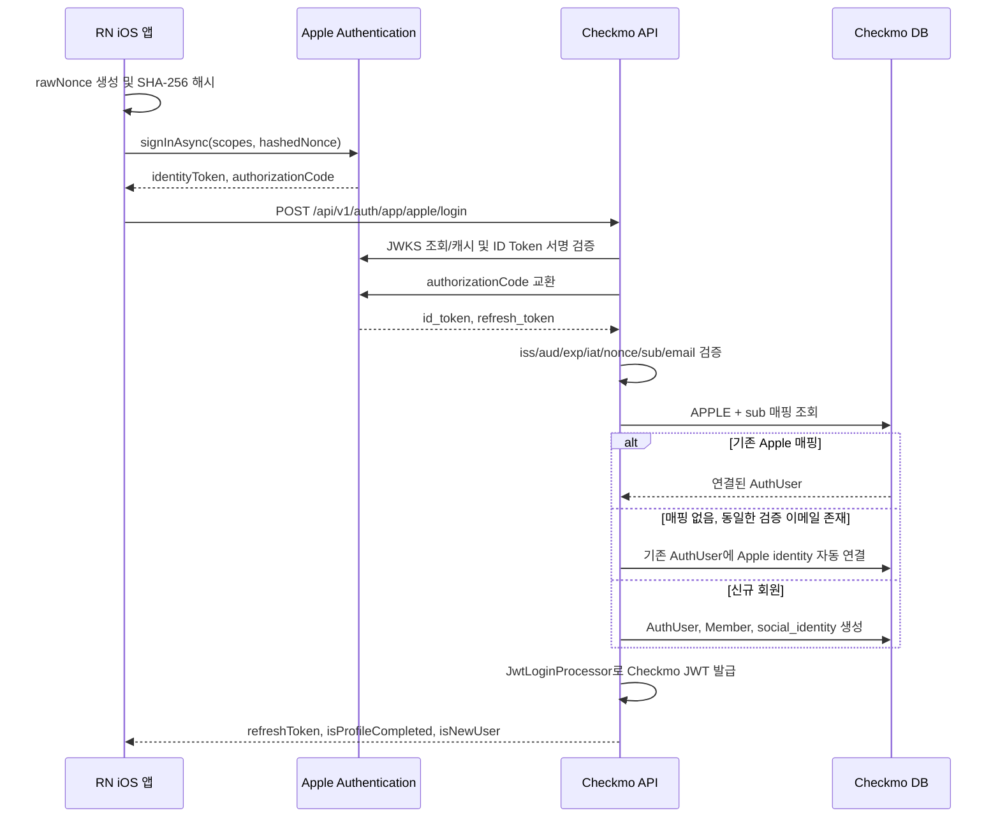

# Apple 로그인 백엔드 구현 계획

> 작성 기준일: 2026-06-18 KST
> 기준 코드: `checkmo_be2`
> 연동 클라이언트: iOS React Native 앱(`kr.co.checkmo.app`)
> 상태: 구현 대기

## 1. 목적과 범위

iOS 앱이 Apple 네이티브 인증으로 받은 credential을 백엔드에서 검증하고, 기존 Checkmo JWT 세션으로 교환하는 기능을 추가한다.

- 1차 지원 범위는 iOS 앱이다. Android, Web Apple 로그인은 제외한다.
- Apple의 안정 식별자인 `sub`를 로그인 기준으로 사용한다.
- 최초 Apple 로그인에서 검증된 이메일이 기존 Checkmo 회원과 같으면 해당 계정에 자동 연결한다.
- 신규 Apple 회원은 `profileCompleted=false`로 생성하고 기존 추가정보 입력 흐름을 재사용한다.
- Apple authorization code를 교환해 refresh token을 보관하고, 회원탈퇴 시 Apple credential도 해지한다.
- 기존 이메일 로그인과 Google/Kakao/Naver 웹 OAuth 흐름은 변경하지 않는다.

## 2. 현재 인증 구조

### 앱 로그인과 세션 유지

1. RN은 `POST /api/v1/auth/app/login`에 이메일 또는 닉네임과 비밀번호를 보낸다.
2. `AuthFacade`가 `AuthSessionCommandService`로 인증한다.
3. `JwtLoginProcessor`가 access/refresh token 쿠키를 기록하고 refresh token을 반환한다.
4. RN은 응답의 refresh token을 `expo-secure-store`에 저장한다.
5. access token 만료 또는 앱 재시작 후 401이 발생하면 `/api/v1/auth/app/refresh`로 refresh token을 회전한다.

Apple 로그인도 3~5번의 기존 세션 발급·저장·회전 로직을 그대로 사용해야 한다. Apple credential 자체를 Checkmo API 인증 토큰으로 사용하지 않는다.

### 프로필 미완성 회원

`ProfileCompletionAuthorizationFilter`는 `AuthUser.profileCompleted=false`인 회원의 일반 API 접근을 제한한다. 추가정보 저장, 로그아웃 등 프로필 완성에 필요한 예외 경로만 허용한다.

Apple 신규 회원도 다음 규칙을 따른다.

- `AuthUser`와 `Member` 생성
- `profileCompleted=false`
- Checkmo JWT 세션은 즉시 발급
- RN은 기존 `/api/v1/members/additional-info` 흐름으로 이동
- 추가정보 저장 완료 후 기존 방식으로 `profileCompleted=true` 처리

## 3. 전체 로그인 시퀀스



## 4. 앱 Apple 로그인 API 계약

### 요청

```http
POST /api/v1/auth/app/apple/login
Content-Type: application/json
```

```json
{
  "identityToken": "eyJraWQiOiJ...",
  "authorizationCode": "c1234567890...",
  "rawNonce": "f6fb53f4c9f3487e9bc44ef6d4f7b4fc"
}
```

세 필드는 모두 필수다.

| 필드 | 검증 |
| --- | --- |
| `identityToken` | 공백 불가, Apple 서명 JWT여야 함 |
| `authorizationCode` | 공백 불가, Apple에서 이번 인증 요청에 발급한 일회성 코드 |
| `rawNonce` | 공백 불가, 충분한 엔트로피를 가진 원문 nonce |

### 성공 응답

```json
{
  "isSuccess": true,
  "code": "COMMON_200",
  "message": "성공입니다.",
  "result": {
    "refreshToken": "checkmo-refresh-token",
    "isProfileCompleted": false,
    "isNewUser": true
  }
}
```

- JSON 필드명을 보장하기 위해 DTO에 필요하면 `@JsonProperty("isProfileCompleted")`, `@JsonProperty("isNewUser")`를 명시한다.
- access/refresh token 쿠키 기록은 기존 `JwtLoginProcessor` 동작을 유지한다.
- `isNewUser`는 이번 요청에서 새 `AuthUser`를 생성했을 때만 `true`다. 기존 이메일에 자동 연결한 경우는 `false`다.

### 오류 계약

백엔드와 RN 문서에서 아래 계약을 동일하게 사용한다.

| HTTP | 코드 | 조건 | RN 처리 |
| --- | --- | --- | --- |
| 400 | `APPLE_AUTH_400` | 필수 credential 누락, 형식 오류, 최초 가입에 사용 가능한 검증 이메일 없음 | Apple 로그인을 완료할 수 없다는 안내 |
| 401 | `APPLE_AUTH_401` | 서명·issuer·audience·만료·nonce 검증 실패 또는 authorization code 무효/재사용 | 인증 실패 안내 후 재시도 허용 |
| 409 | `APPLE_AUTH_409` | Apple identity가 다른 회원에 이미 연결됨, 동시 연결 충돌 | 다른 계정에 연결된 Apple 계정 안내 |
| 502 | `APPLE_AUTH_502` | Apple JWKS/token/revoke 서버 장애 또는 타임아웃 | 잠시 후 다시 시도 안내 |
| 500 | `COMMON_500` | 저장·암호화·JWT 발급 등 내부 오류 | 일반 로그인 실패 안내 |

응답이나 로그에 Apple token, authorization code, raw nonce, private key를 포함하지 않는다.

## 5. Apple credential 검증

### ID Token 검증 순서

1. JWT header에서 `kid`, `alg`를 읽고 `alg=RS256`인지 확인한다.
2. `https://appleid.apple.com/auth/keys`의 JWKS에서 `kid`에 맞는 RSA 공개키를 찾는다.
3. JWT 서명을 검증한다.
4. `iss`가 `https://appleid.apple.com`인지 확인한다.
5. `aud`가 iOS Bundle ID `kr.co.checkmo.app`인지 확인한다.
6. `exp`, `iat`를 서버 UTC 시각과 허용 오차 범위 내에서 확인한다.
7. token의 `nonce`가 `SHA-256(rawNonce)`의 lowercase hex 값과 같은지 상수 시간 비교한다.
8. 비어 있지 않은 `sub`를 추출한다.
9. 신규 생성 또는 이메일 자동 연결이 필요하면 `email`과 `email_verified=true`를 요구한다.

JWKS는 짧은 네트워크 장애에 로그인 전체가 의존하지 않도록 메모리 캐시한다. 캐시 TTL은 Apple 응답의 캐시 헤더를 우선 사용하고, 모르는 `kid`가 들어오면 JWKS를 한 번 강제 갱신한 뒤 다시 검증한다. 두 번째에도 키가 없으면 `APPLE_AUTH_401`로 종료한다.

### Authorization code 교환

ID Token 서명 검증만으로 요청을 끝내지 않는다.

1. Team ID, Key ID, Bundle ID와 Apple private key로 ES256 client secret JWT를 생성한다.
2. `POST https://appleid.apple.com/auth/token`에 다음 값을 전송한다.
   - `client_id=kr.co.checkmo.app`
   - `client_secret=<동적 생성 JWT>`
   - `code=<authorizationCode>`
   - `grant_type=authorization_code`
3. 교환 응답의 `id_token`도 서명·issuer·audience·만료를 검증한다.
4. 최초 `identityToken.sub`와 교환 응답 `id_token.sub`가 같은지 확인한다.
5. 반환된 Apple refresh token을 암호화해서 저장한다.

authorization code는 Apple에서 일회성으로 처리되므로 같은 코드를 다시 사용한 요청은 `APPLE_AUTH_401`로 거절한다. 백엔드 자체에서도 authorization code 또는 안전한 단방향 해시를 짧은 TTL로 기록해 동시에 들어온 재사용 요청을 빠르게 차단할 수 있다.

## 6. 소셜 식별자 데이터 모델

현재 `AuthUser.id`의 접두사만으로 provider를 표현하는 구조는 기존 LOCAL 계정에 Apple을 연결하는 경우를 표현할 수 없다. Flyway migration으로 별도 테이블을 추가한다.

```sql
CREATE TABLE social_identity (
    id BIGINT NOT NULL AUTO_INCREMENT,
    auth_user_id VARCHAR(255) NOT NULL,
    provider VARCHAR(20) NOT NULL,
    provider_subject VARCHAR(255) NOT NULL,
    provider_email VARCHAR(255) NULL,
    provider_refresh_token TEXT NULL,
    revoke_status VARCHAR(20) NOT NULL DEFAULT 'ACTIVE',
    revoke_retry_count INT NOT NULL DEFAULT 0,
    revoke_next_retry_at DATETIME(6) NULL,
    created_at DATETIME(6) NOT NULL,
    updated_at DATETIME(6) NOT NULL,
    PRIMARY KEY (id),
    CONSTRAINT fk_social_identity_auth_user
        FOREIGN KEY (auth_user_id) REFERENCES auth_user (id),
    CONSTRAINT uk_social_identity_provider_subject
        UNIQUE (provider, provider_subject),
    CONSTRAINT uk_social_identity_user_provider
        UNIQUE (auth_user_id, provider)
);
```

정확한 timestamp default와 FK 삭제 정책은 기존 migration 스타일을 따른다. `provider_refresh_token`에는 평문이 아니라 버전·IV·ciphertext·authentication tag를 포함한 암호문만 저장한다.

권장 상태:

- `ACTIVE`: 로그인과 해지에 사용할 수 있는 정상 연결
- `REVOKE_PENDING`: 탈퇴 과정에서 Apple 해지가 실패해 재시도 대기
- `REVOKED`: Apple 해지 완료

Google/Kakao/Naver 기존 계정을 이번 migration에서 역으로 채우지 않는다. 테이블은 Apple부터 사용하되 향후 다른 provider로 확장 가능한 형태로 만든다.

## 7. 회원 조회·자동 연결·신규 생성

모든 조회와 저장은 하나의 트랜잭션 경계에서 처리한다.

### 1순위: 기존 Apple identity

`provider=APPLE`, `provider_subject=sub`로 `social_identity`를 조회한다.

- 존재하면 연결된 `AuthUser`로 로그인한다.
- 이후 Apple ID Token에 이메일이 없더라도 로그인할 수 있다.
- token에 새 이메일이 있더라도 `sub`가 같으면 다른 회원으로 재연결하지 않는다.
- 탈퇴 상태 계정이면 기존 `JwtLoginProcessor`의 계정 복구 정책과 일관되게 처리한다.

### 2순위: 검증 이메일 자동 연결

identity가 없고 `email_verified=true`인 이메일이 기존 `AuthUser.email`과 정확히 일치하면 해당 계정에 Apple identity를 생성한다.

- 대소문자 정규화는 기존 이메일 저장·중복 검사 정책과 동일하게 적용한다.
- 기존 계정의 ID, 비밀번호, 프로필, 게시물은 변경하지 않는다.
- `isNewUser=false`를 반환한다.
- 이미 그 회원에 다른 Apple identity가 연결되어 있거나 해당 `sub`가 다른 회원에 연결되었으면 `APPLE_AUTH_409`를 반환한다.

### 3순위: 신규 회원

기존 identity와 이메일 회원이 모두 없으면 다음 순서로 생성한다.

1. `APPLE_<UUID>` 형식의 내부 회원 ID를 만든다. Apple `sub` 원문을 내부 ID에 넣지 않는다.
2. password는 기존 소셜 회원 정책과 호환되는 빈 문자열로 저장한다.
3. role은 `USER`, `profileCompleted=false`로 설정한다.
4. `AuthenticationEvent.CreateMember(id, email)`를 발행해 동일 ID의 `Member`를 만든다.
5. `social_identity`에 Apple `sub`, 이메일, 암호화된 refresh token을 저장한다.
6. `isNewUser=true`를 반환한다.

최초 로그인에 이메일이 없거나 `email_verified`가 참이 아니면 현재 `AuthUser.email`과 `Member.email` 제약을 만족시킬 수 없으므로 `APPLE_AUTH_400`으로 거절한다. Apple 비공개 릴레이 이메일은 검증된 이메일이면 정상 허용한다.

### 경쟁 조건

- 애플리케이션의 사전 조회만 신뢰하지 않고 DB 유니크 제약을 최종 기준으로 삼는다.
- 저장 시 unique constraint 위반이 발생하면 동일 `sub` identity를 다시 조회한다.
- 같은 회원 연결로 수렴하면 해당 회원으로 로그인하고, 다른 회원과 충돌하면 `APPLE_AUTH_409`를 반환한다.
- `AuthUser`만 생성되고 `Member` 또는 identity 생성이 실패하는 부분 저장을 허용하지 않는다.

## 8. 비밀값과 토큰 보관

환경별 secret manager 또는 CI secret에 다음 값을 등록한다.

```dotenv
APPLE_TEAM_ID=<apple-developer-team-id>
APPLE_KEY_ID=<sign-in-with-apple-key-id>
APPLE_CLIENT_ID=kr.co.checkmo.app
APPLE_PRIVATE_KEY=<pkcs8-private-key>
APPLE_TOKEN_ENCRYPTION_KEY=<base64-encoded-aes-key>
```

- 실제 값과 `.p8` 파일을 Git, 이미지, 문서, 로그에 커밋하지 않는다.
- private key의 개행 인코딩 규칙을 배포 환경마다 동일하게 정한다.
- Apple client secret은 요청 시 생성하거나 짧게 캐시하되 최대 유효기간보다 충분히 일찍 폐기한다.
- Apple refresh token은 AES-GCM 같은 인증 암호화로 저장한다.
- 암호문에 key version을 포함해 추후 encryption key rotation이 가능하게 한다.
- 복호화 실패는 token 값을 로그에 남기지 않고 운영 오류로 집계한다.

## 9. 회원탈퇴와 Apple 해지

기존 `/api/v1/members/withdrawal` 흐름에서 인증 모듈이 계정을 비활성화하기 전에 Apple identity를 확인한다.

1. 연결된 ACTIVE Apple identity가 있으면 refresh token을 복호화한다.
2. 유효한 Apple client secret을 생성한다.
3. `POST https://appleid.apple.com/auth/revoke`에 refresh token과 `token_type_hint=refresh_token`을 보낸다.
4. 성공하면 token 암호문을 제거하고 `REVOKED`로 변경한다.
5. Apple 타임아웃/5xx 등 일시 장애면 `REVOKE_PENDING`과 다음 재시각을 기록한다.
6. Apple 해지 실패 여부와 무관하게 Checkmo 탈퇴·세션 폐기는 완료한다.

재시도 스케줄러는 지수 backoff와 최대 재시도 횟수를 사용한다. 영구 실패는 민감값 없이 모니터링하고, 계정 영구 삭제 스케줄러가 identity를 지우기 전에 해지 상태를 확인한다.

일반 로그아웃에서는 Apple token을 해지하지 않는다. Checkmo access/refresh token과 서버 캐시만 기존 방식으로 폐기한다.

## 10. 변경 컴포넌트와 책임

| 영역 | 변경 책임 |
| --- | --- |
| `AuthController`, Auth DTO | `/app/apple/login` 요청 검증과 동일한 응답 envelope 제공 |
| `AuthFacade` | Apple 인증 결과를 `PrincipalDetails`와 `JwtLoginProcessor`에 연결 |
| Apple login service | 검증 결과에 따른 identity 조회, 자동 연결, 신규 회원 생성 트랜잭션 |
| Apple token verifier | JWKS, JWT 서명과 claim, nonce 검증 |
| Apple token client | client secret 생성, `/auth/token`, `/auth/revoke` 호출과 타임아웃 |
| `SocialIdentity` entity/repository | provider subject 매핑, 암호화 token, revoke 상태 영속화 |
| token encryption component | Apple refresh token 인증 암호화·복호화·key version 처리 |
| `AuthConverter` | `APPLE_<UUID>` 신규 `AuthUser` 생성 지원 |
| `MemberQueryFacade` | Apple 연결 계정의 login-status provider 표시 정책 반영 |
| withdrawal/scheduler | 즉시 revoke와 실패 재시도 |
| Flyway | `social_identity` 테이블과 인덱스 추가 |
| security/error model | 공개 로그인 경로 확인, `APPLE_AUTH_*` 오류 정의 |

`retrieveLoginStatus()`가 현재 회원 ID 접두사만 보는 구조이므로 다음 기준으로 바꾼다.

- APPLE ID 신규 회원은 `APPLE` 반환
- LOCAL 등 기존 회원에 Apple이 자동 연결된 경우 계정의 기존 로그인 수단을 깨지 않도록 기존 provider를 유지
- 추후 복수 로그인 수단 표시가 필요하면 별도 `providers[]` 계약으로 확장하며 이번 API에서는 추가하지 않음

## 11. 테스트 계획

### 단위·통합 테스트

- 정상 Apple ID Token의 서명과 전체 claim 검증
- 알 수 없는 `kid`에서 JWKS 1회 갱신
- 잘못된 서명, `alg`, issuer, audience, nonce, 만료 token 거부
- authorization code 교환 성공과 재사용 거부
- 두 ID Token의 `sub` 불일치 거부
- 신규 회원의 `AuthUser`, `Member`, `social_identity` 동시 생성
- 기존 Apple identity 재로그인 시 중복 row 없음
- 기존 이메일 계정 자동 연결과 `isNewUser=false`
- Apple 비공개 릴레이 이메일 신규 가입
- 이메일 없는 재로그인 성공, 이메일 없는 최초 가입 실패
- 다른 회원에 연결된 `sub` 충돌과 동시 요청 경쟁 처리
- Checkmo refresh token 반환·쿠키·Redis 저장
- 프로필 미완성 회원의 추가정보 API 허용과 일반 보호 API 403
- 회원탈퇴 revoke 성공, 일시 실패의 `REVOKE_PENDING`, 스케줄러 재시도
- 로그와 오류 응답에 민감한 credential이 없는지 확인

Apple 네트워크는 테스트에서 mock server 또는 client interface mock으로 대체한다. CI 테스트가 실제 Apple 서버나 운영 secret에 의존하지 않게 한다.

## 12. 구현·배포 순서

1. Apple Developer에서 App ID capability와 Sign in with Apple key를 준비한다.
2. 운영·개발 환경에 Apple 및 암호화 secret을 등록한다.
3. Flyway migration과 social identity 저장 계층을 배포한다.
4. Apple verifier/token client와 단위 테스트를 추가한다.
5. 로그인 service, controller, 오류 계약과 API 테스트를 추가한다.
6. 회원탈퇴 revoke와 재시도 스케줄러를 추가한다.
7. 백엔드를 먼저 배포하고 새 API를 smoke test한다.
8. 이후 Apple 버튼이 포함된 RN 빌드를 배포한다.
9. 신규/기존/비공개 이메일 계정으로 실기기 E2E를 수행한다.

관측 항목:

- Apple 로그인 성공/실패 수와 오류 코드 비율
- JWKS/token endpoint latency 및 장애율
- 이메일 자동 연결 수
- `APPLE_AUTH_409` 수
- `REVOKE_PENDING` 적재량과 최장 대기 시간

## 13. 롤백 기준

- RN에서 Apple 버튼을 숨겨 신규 요청 유입을 먼저 중단한다.
- 백엔드 API는 기존 Apple 로그인 세션과 탈퇴 해지를 위해 당분간 유지한다.
- migration은 기존 인증 테이블을 변경하지 않는 추가형이므로 즉시 drop하지 않는다.
- JWT 발급 장애, 잘못된 회원 자동 연결, token 검증 우회가 발견되면 Apple 로그인 API를 비활성화한다.
- 이미 생성·연결된 identity를 자동 삭제하거나 기존 `AuthUser`를 되돌리지 않는다. 데이터 확인 후 별도 교정 절차를 사용한다.

## 14. 완료 조건

- [ ] 위 API 계약과 오류 코드가 OpenAPI에 반영됨
- [ ] Apple ID Token과 authorization code를 모두 서버에서 검증함
- [ ] Apple `sub` 기반 재로그인과 검증 이메일 자동 연결이 동작함
- [ ] 신규 Apple 회원이 기존 프로필 추가정보 흐름을 완료할 수 있음
- [ ] Apple refresh token이 암호화 저장되고 탈퇴 시 해지됨
- [ ] 기존 이메일 및 Google/Kakao/Naver 로그인이 회귀하지 않음
- [ ] 자동 테스트와 iOS 실기기 E2E가 통과함
- [ ] secret, token, nonce가 저장소와 로그에 노출되지 않음

## 15. 공식 참고 자료

- [Apple - Verifying a user](https://developer.apple.com/documentation/signinwithapple/verifying-a-user)
- [Apple - Token validation](https://developer.apple.com/documentation/signinwithapplerestapi/generate-and-validate-tokens)
- [Apple - Revoke tokens](https://developer.apple.com/documentation/signinwithapplerestapi/revoke-tokens)
- [Apple TN3194 - Account deletion and token revocation](https://developer.apple.com/documentation/technotes/tn3194-handling-account-deletions-and-revoking-tokens-for-sign-in-with-apple)
- [Apple OpenID configuration](https://appleid.apple.com/.well-known/openid-configuration)
- [Apple JWKS](https://appleid.apple.com/auth/keys)
